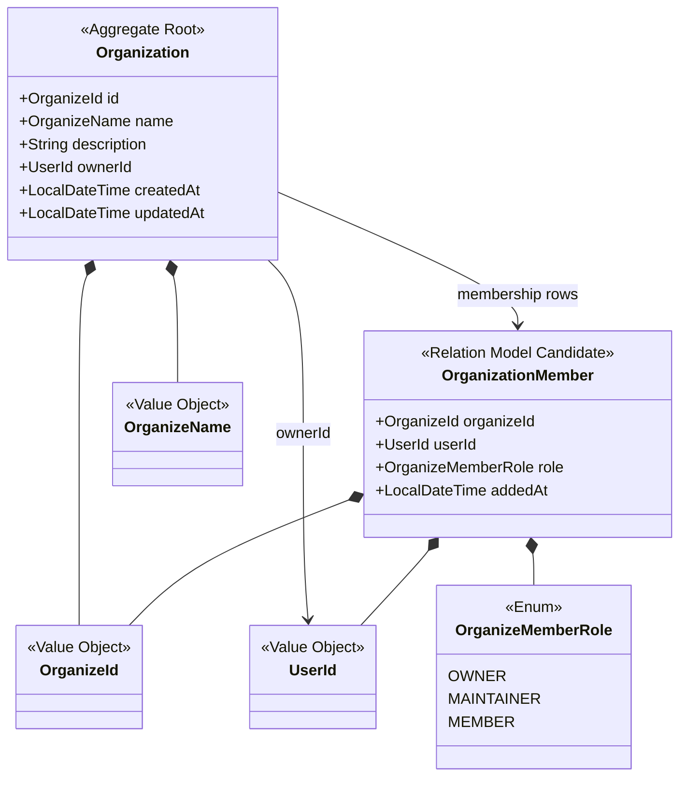
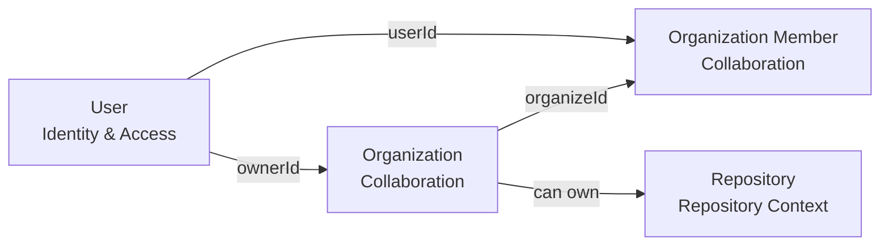
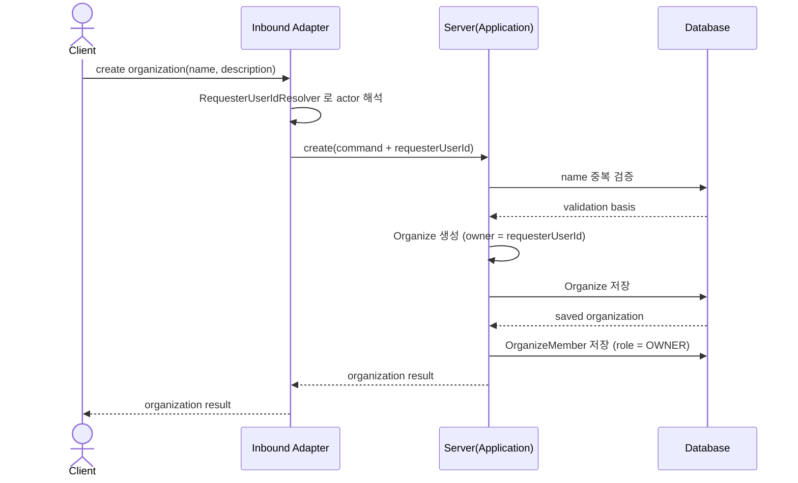
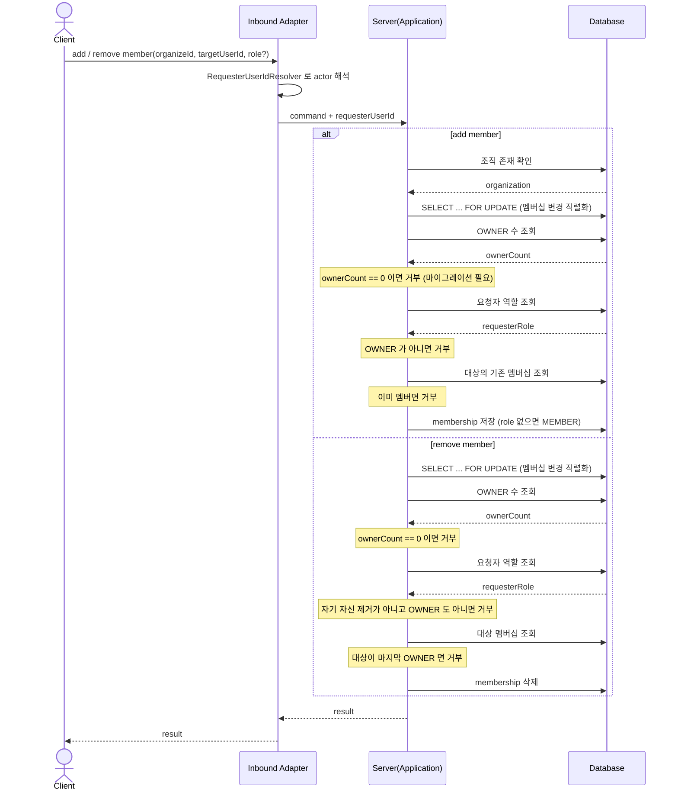
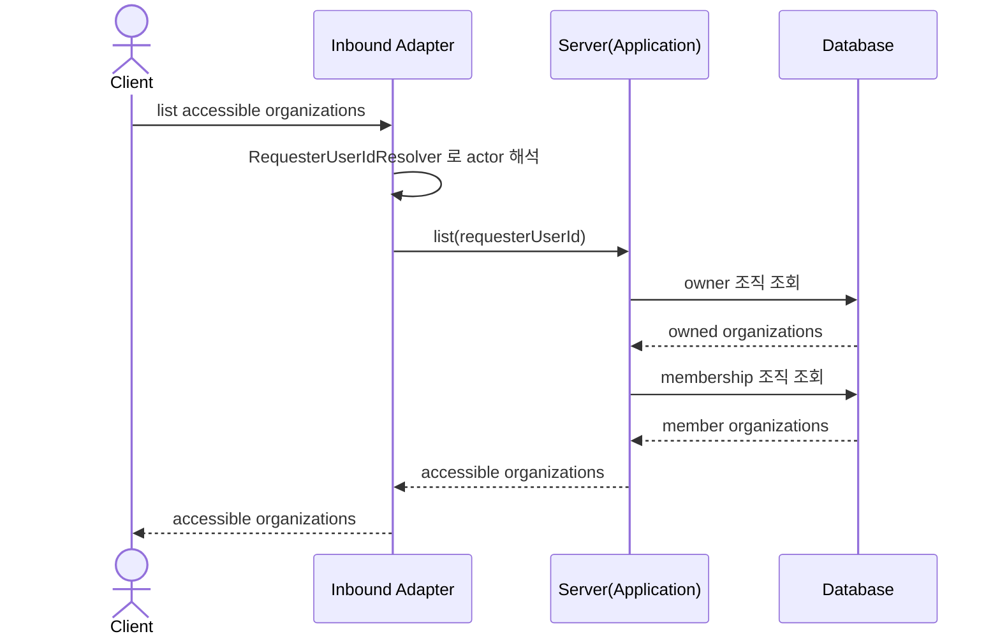

## Collaboration Context Diagrams

### TOC

- [목적](#목적)
- [Aggregate 구조 다이어그램](#aggregate-구조-다이어그램)
- [관계 다이어그램](#관계-다이어그램)
- [Organization 생성 시퀀스 다이어그램](#organization-생성-시퀀스-다이어그램)
- [Organization Member 추가 / 제거 시퀀스 다이어그램](#organization-member-추가--제거-시퀀스-다이어그램)
- [접근 가능 Organization 조회 시퀀스 다이어그램](#접근-가능-organization-조회-시퀀스-다이어그램)

### 목적

`Collaboration Context`의 구조와 흐름을 정리한 문서다. 본문은 [Collaboration Context](./context.md)를 참고한다.

### Aggregate 구조 다이어그램

현재 구현은 `Organization Member`를 aggregate 내부 collection보다 관계 모델에 가깝게 다룬다.

### 관계 다이어그램

조직은 사용자와 저장소 사이의 협업 단위다.

### Organization 생성 시퀀스 다이어그램

**actor 는 애플리케이션이 찾지 않는다.** 인바운드 어댑터가 `RequesterUserIdResolver` 로
해석해 커맨드에 담아 넘긴다 (task 2.60/2.62/2.64). 애플리케이션이 보안 컨텍스트를 직접
읽으면 권한 판정이 주변 상태에 의존하게 되고, 특정 actor 로 시험할 수 없다.

생성자는 조직의 첫 `OWNER` 멤버로 함께 저장된다. 이 행이 없으면 이후 멤버 관리가
"소유자 없음" 으로 막힌다.

- persisted
  - `Organize`
  - `ownerId`
  - `name`
  - `OrganizeMember` (생성자, `OWNER`)
- computed
  - 없음

### Organization Member 추가 / 제거 시퀀스 다이어그램

이 다이어그램의 검증 단계는 장식이 아니라 순서가 의미를 갖는다.

- **행 잠금이 먼저다.** `lockByIdForMembershipMutation` 없이 OWNER 수를 세면 두 요청이
  동시에 "아직 OWNER 가 하나 더 있다" 를 읽고 마지막 소유자를 함께 제거할 수 있다.
- **OWNER 수 0 은 거부다.** 멤버십 도입 이전 데이터로, 권한 판정의 기준이 없는 상태다.
  통과시키면 아무나 멤버를 관리하게 된다.
- **추가는 OWNER 만, 제거는 OWNER 또는 본인.** 본인 탈퇴는 허용하되, 마지막 OWNER 는
  자기 자신도 나갈 수 없다. 조직이 관리 불가 상태로 남기 때문이다.
- role 이 없으면 기본값 `MEMBER` 다.

### 접근 가능 Organization 조회 시퀀스 다이어그램

현재 접근 가능 여부는 owner 또는 member 여부를 기준으로 계산한다.

---

## 갱신 이력

**2026-08-28 (task 2.87).** 이 문서는 2026-05-20 이후 갱신되지 않아, 같은 컨텍스트의
산문(`context.md`, 2026-08-22)과 다른 시점을 서술하고 있었다. 그림이 뒤처진 지점 넷:

| 항목 | 옛 그림 | 현재 |
|---|---|---|
| actor 해석 | `App->>App: 현재 사용자 식별` | 인바운드 어댑터가 해석해 커맨드로 전달 (2.60/2.62/2.64) |
| 멤버 추가 | 중복 검증만 | 행 잠금 → OWNER 수 확인 → OWNER 인가 → 중복 검증 |
| 멤버 제거 | 삭제만 | 행 잠금 → OWNER 수 확인 → 역할 확인 → 마지막 OWNER 보호 |
| `OrganizeMemberRole` | `MEMBER` 만 | `OWNER`, `MAINTAINER`, `MEMBER` |

산문과 그림이 갈리면 그림이 뒤처진 쪽이다. 흐름을 바꾸는 변경은 이 문서를 함께 고친다.