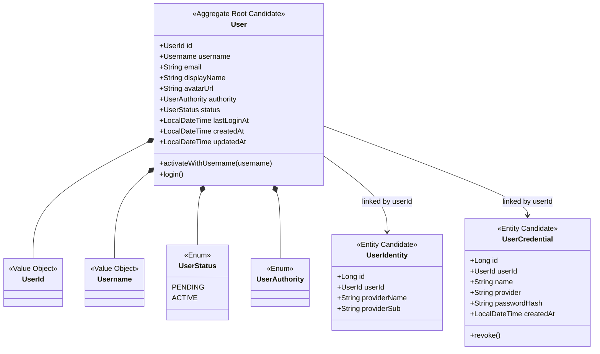
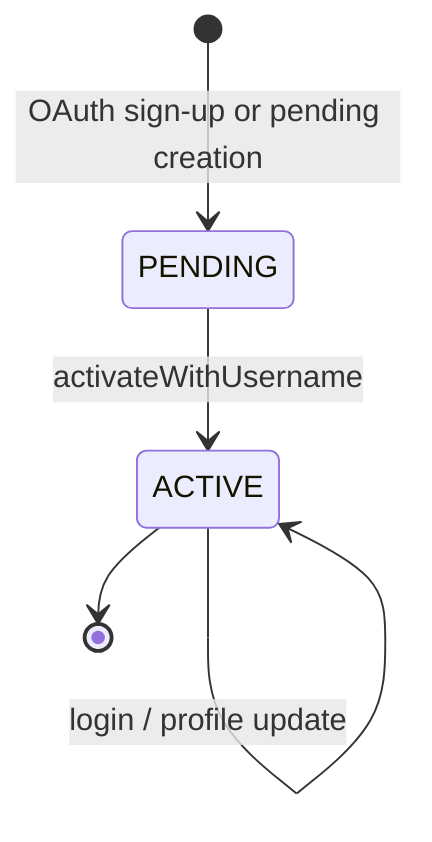
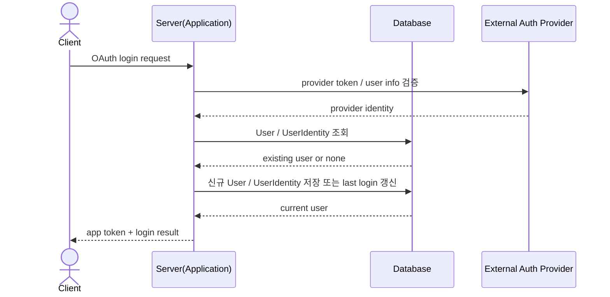
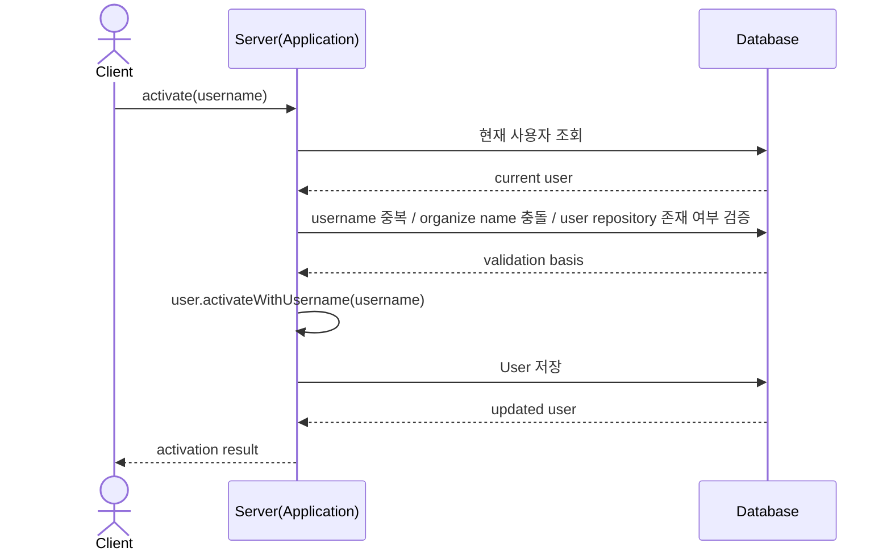
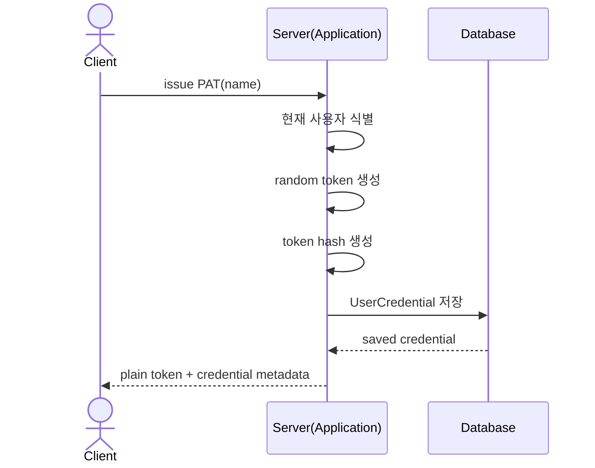
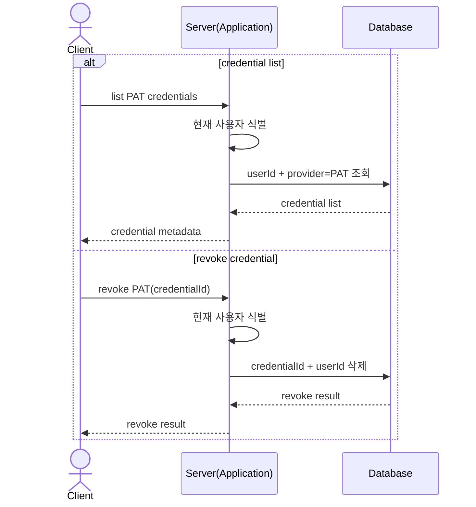

## Identity & Access Context Diagrams

### TOC

- [목적](#목적)
- [Aggregate 구조 다이어그램](#aggregate-구조-다이어그램)
- [상태 전이 다이어그램](#상태-전이-다이어그램)
- [OAuth 로그인 시퀀스 다이어그램](#oauth-로그인-시퀀스-다이어그램)
- [Username 활성화 시퀀스 다이어그램](#username-활성화-시퀀스-다이어그램)
- [PAT 발급 시퀀스 다이어그램](#pat-발급-시퀀스-다이어그램)
- [PAT 조회 / 폐기 시퀀스 다이어그램](#pat-조회--폐기-시퀀스-다이어그램)

### 목적

`Identity & Access Context`의 구조와 흐름을 정리한 문서다. 본문은 [Identity & Access Context](./context.md)를 참고한다.

### Aggregate 구조 다이어그램

`User`가 중심 모델이고, `UserIdentity`와 `UserCredential`은 현재 `userId`로 연결되는 종속 모델이다.

### 상태 전이 다이어그램

현재 문서 기준 핵심 상태는 `PENDING`, `ACTIVE`다.

### OAuth 로그인 시퀀스 다이어그램

애플리케이션 내부에서는 `loginOrSignUp(...)`, identity 연결, 앱 토큰 발급을 수행한다.

- persisted
  - `User`
  - `UserIdentity`
  - `lastLoginAt`
- computed
  - 앱 토큰

### Username 활성화 시퀀스 다이어그램

애플리케이션 내부에서는 형식 검증과 상태 전이 호출을 수행한다.

- persisted
  - `username`
  - `status=ACTIVE`
  - `updatedAt`
- computed
  - 없음

### PAT 발급 시퀀스 다이어그램

애플리케이션 내부에서는 원문 토큰 생성과 해시 저장을 분리한다.

- persisted
  - `UserCredential`
  - `passwordHash`
  - `provider=PAT`
- computed
  - 원문 PAT

### PAT 조회 / 폐기 시퀀스 다이어그램

조회와 폐기는 모두 현재 사용자 경계를 기준으로 수행한다.
