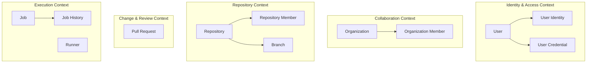

# Bounded Context Overview

## TOC

- [목적](#목적)
- [작성 기준](#작성-기준)
- [개념 목록](#개념-목록)
- [User](#user)
- [User Identity](#user-identity)
- [User Credential](#user-credential)
- [Organization](#organization)
- [Organization Member](#organization-member)
- [Repository](#repository)
- [Repository Member](#repository-member)
- [Branch](#branch)
- [Pull Request](#pull-request)
- [Job](#job)
- [Job History](#job-history)
- [Runner](#runner)
- [전체 Bounded Context 개요 맵](#전체-bounded-context-개요-맵)
- [그래프에서 제외한 주요 개념](#그래프에서-제외한-주요-개념)
- [1차 Aggregate 후보 표](#1차-aggregate-후보-표)
- [Aggregate가 아닌 것으로 먼저 보는 개념](#aggregate가-아닌-것으로-먼저-보는-개념)
- [현재 문서와의 관계](#현재-문서와의-관계)

## 목적

이 문서는 `jgitkins` bounded context 용어와 경계 초안이다. Aggregate 상세 문서의 기준으로 사용한다.

## 작성 기준

- 제품 용어 기준으로 정리한다.
- 코드와 테이블은 근거로만 사용한다.
- Aggregate 여부는 현재 판단만 기록한다.

## 개념 목록

### User

- 정의: 로그인, 소유, 권한 판단의 기준이 되는 사용자 계정.
- 현재 분류: Entity 또는 Aggregate Root 후보.
- 코드 근거: `app-server/src/main/java/io/jgitkins/server/identity/access/domain/aggregate/User.java`, `UserIdentity.java`, `UserCredential.java`, `UserAuthority.java`, `UserStatus.java`.
- 테이블 근거: `USER`, `USER_CREDENTIALS`.
- 메모: 인증 identity와 credential 경계가 함께 걸려 있다.

### User Identity

- 정의: 외부 인증 제공자에서 온 사용자 신원.
- 현재 분류: `User` 하위 Entity 후보.
- 코드 근거: `app-server/src/main/java/io/jgitkins/server/identity/access/domain/entity/UserIdentity.java`, `OAuthLoginUseCase`, `OAuthLoginService`.
- 메모: 외부 로그인 결과를 내부 `User`와 연결한다.

### User Credential

- 정의: 사용자의 개인 자격증명. 현재는 PAT 중심.
- 현재 분류: `User` 하위 Entity 후보.
- 코드 근거: `app-server/src/main/java/io/jgitkins/server/identity/access/domain/entity/UserCredential.java`, `UserCredentialIssueUseCase`, `UserCredentialService`.
- 테이블 근거: `USER_CREDENTIALS`.
- 메모: 만료, 사용 이력, 감사 요구가 커지면 별도 Aggregate 후보가 된다.

### Organization

- 정의: 여러 사용자가 함께 저장소를 소유하는 협업 단위.
- 현재 분류: Aggregate Root.
- 코드 근거: `app-server/src/main/java/io/jgitkins/server/collaboration/domain/aggregate/Organize.java`, `OrganizeMember.java`, `OrganizeCreationUseCase`, `OrganizeMember*UseCase`.
- 테이블 근거: `ORGANIZE`, `ORGANIZE_MEMBER`.
- 메모: 코드명은 `Organize`, 문서 용어는 `Organization`을 사용한다.

### Organization Member

- 정의: 특정 `Organization`에 속한 사용자와 역할.
- 현재 분류: Entity 또는 관계 모델.
- 코드 근거: `app-server/src/main/java/io/jgitkins/server/collaboration/domain/entity/OrganizeMember.java`, `OrganizeMemberRole.java`.
- 테이블 근거: `ORGANIZE_MEMBER`.
- 메모: `Repository Member`와 같은 membership 패턴의 scope별 변형이다.

### Repository

- 정의: Git 저장소와 서비스 메타데이터를 함께 가지는 작업 단위.
- 현재 분류: Aggregate Root.
- 코드 근거: `app-server/src/main/java/io/jgitkins/server/repository/domain/aggregate/Repository.java`, `RepositoryManagementUseCase`, `RepositoryLoadUseCase`, `RepositoryManagementService`.
- 테이블 근거: `REPOSITORY`.
- 주요 값: `RepositoryId`, `RepositoryName`, `RepositoryPath`, `RepositoryVisibility`, `OwnerType`, `OwnerId`, `BranchName`.
- 메모: Git object graph 자체는 외부 상태다.

### Repository Member

- 정의: 특정 `Repository`에 접근 가능한 사용자와 역할.
- 현재 분류: Entity 또는 관계 모델.
- 코드 근거: `app-server/src/main/java/io/jgitkins/server/repository/domain/model/RepositoryMember.java`, `RepositoryMemberRole.java`, `RepositoryMember*UseCase`.
- 테이블 근거: `REPOSITORY_MEMBER`.
- 메모: 현재는 `Repository` 내부 Entity보다 관계 모델에 가깝다.

### Branch

- 정의: `Repository` 안의 Git branch와 branch 메타데이터.
- 현재 분류: Entity 후보.
- 코드 근거: `app-server/src/main/java/io/jgitkins/server/repository/domain/entity/Branch.java`, `BranchName.java`, `BranchManagementUseCase`, `BranchLoadUseCase`, `BranchManagementService`.
- 테이블 근거: `BRANCH`.
- 메모: `Repository`에 종속된 Entity로 본다.

### Pull Request

- 정의: source branch 변경을 target branch에 합치기 위한 요청.
- 현재 분류: Aggregate Root.
- 코드 근거: `app-server/src/main/java/io/jgitkins/server/change/review/domain/aggregate/PullRequest.java`, `CreatePullRequestUseCase`, `GetPullRequestDetailUseCase`, `PullRequestCreateService`, `PullRequestQueryService`.
- 테이블 근거: `PULL_REQUEST`.
- 주요 값: `PullRequestId`, `BranchHeadSnapshot`, `PullRequestStatus`, `TargetDrift`.
- 메모: source/target snapshot은 저장 상태이고 mergeability는 조회 계산값이다.

### Job

- 정의: 특정 repository, branch, commit에 대한 CI 실행 요청.
- 현재 분류: Aggregate Root.
- 코드 근거: `app-server/src/main/java/io/jgitkins/server/execution/domain/aggregate/Job.java`, `JobHistory.java`, `JobCreateUseCase`, `JobDispatchUseCase`, `JobResultReportUseCase`.
- 테이블 근거: `JOB`, `JOB_HISTORY`.
- 메모: `JobHistory`를 내부 Entity로 가지는 모델이 현재 구현과 맞다.

### Job History

- 정의: `Job` 상태 변경 기록.
- 현재 분류: Entity.
- 코드 근거: `JobHistory.java`, `JobHistoryId.java`, `JobStatus.java`.
- 테이블 근거: `JOB_HISTORY`.
- 메모: `Job` Aggregate 내부 Entity로 본다.

### Runner

- 정의: 할당된 `Job`을 실제로 실행하는 작업자.
- 현재 분류: Aggregate Root.
- 코드 근거: server의 `Runner.java`, runner 모듈의 `RunnerConfiguration.java`, `RunnerActivationUseCase`, `RunnerJobUseCase`.
- 테이블 근거: `RUNNER`, `RUNNER_ASSIGNMENT`.
- 메모: 서버의 runner 등록/활성화와 runner 프로세스 내부 runtime은 같은 경계가 아니다.

상단 목록은 Aggregate Root와 Entity 후보 중심이다. Value Object, Read Model, 계산 결과, 외부 시스템 개념은 아래 표에서 정리한다.

## 전체 Bounded Context 개요 맵

이 맵은 Aggregate Root와 주요 Entity 후보만 표시한다.

## 그래프에서 제외한 주요 개념

| 개념 | 분류 | 메모 |
| --- | --- | --- |
| Namespace | Value Object + 해석 규칙 | owner slug와 namespace 해석에 사용 |
| Repository Path | Value Object | 저장소 slug 정규화와 형식 검증 |
| Commit | External/System Concept | Git object |
| File Tree | Read Model | Git tree 조회 결과 |
| File Content | Read Model 또는 command input | Git blob 조회 또는 업로드 입력 |
| Diff | Read Model 또는 계산 결과 | 두 ref 사이 차이 |
| Change Graph | Domain Service 중심 모델 | branch 관계 해석 |
| Mergeability Assessment | Domain Service 결과 | 조회 시 계산 |
| Pipeline Policy | Application-Level Policy | push event 기준 job 생성 가능 여부와 pipeline file 경로를 계산 |
| Pipeline Config | External Config | Git 안의 설정 파일 |
| Pipeline Execution | Bounded Context | `Job`, `Runner` 위의 실행 흐름 |
| Execution Result | Value Object 또는 command result | 실행 완료 결과 |
| Pull Request Readiness | Read Model 및 Domain Service 결과 | 여러 결과의 조합 |

## 1차 Aggregate 후보 표

| 후보 | 현재 판단 | 근거 | 우선순위 |
| --- | --- | --- | --- |
| Repository | Aggregate Root | 저장소 메타데이터와 생성/초기화 생명주기 | 높음 |
| Organization | Aggregate Root | 조직 생성과 멤버십 경계 | 중간 |
| User | Aggregate Root 후보 | 인증, 상태, credential 생명주기 | 중간 |
| UserIdentity | `User` 하위 Entity 후보 | 외부 신원 연결 | 낮음 |
| UserCredential | `User` 하위 Entity 후보 | 현재는 발급/폐기 중심 | 중간 |
| PullRequest | Aggregate Root | PR snapshot과 상태 전이 | 높음 |
| Job | Aggregate Root | `JobHistory`와 실행 결과 경계 | 높음 |
| Runner | Aggregate Root | 등록, token, activation, heartbeat | 높음 |
| Branch | Entity 후보 | `Repository` 내부 branch 메타데이터 | 높음 |

## Aggregate가 아닌 것으로 먼저 보는 개념

| 개념 | 이유 |
| --- | --- |
| Dashboard | 화면 조회 조합 |
| Explore | 저장소 목록 projection |
| Namespace | owner slug와 해석 규칙 |
| Repository Detail | Repository와 Git 데이터 조합 화면 |
| File Tree | Git tree 조회 결과 |
| File Content | Git blob 조회 또는 upload input |
| Commit | Git object |
| Diff | 계산 결과 |
| Mergeability Assessment | 조회 시 계산값 |
| Pull Request Readiness | 여러 컨텍스트 결과 조합 |
| Push Event | 입력 이벤트 |

## 현재 문서와의 관계

- [Bounded Context Index](./README.md)
  - bounded context 상세 문서의 인덱스

이 문서는 상세 컨텍스트 문서보다 상위의 용어 사전과 경계 초안이다.

## 아웃바운드 계약 명명 규약 (2026-08-28 정정)

이 문서군은 영속화 계약을 `...PersistencePort` 로 부르고 있었다. 그런 이름의 타입은
어느 모듈에도 없다. 개별 오타가 아니라 규약 자체에 대한 오해였으므로, 실제 규약을 적는다.

| 역할 | 규약 | 위치 | 예 |
|---|---|---|---|
| Aggregate 생명주기 (저장·조회·삭제) | `<Aggregate>Repository` | `<context>/domain/repository/` | `JobRepository`, `UserRepository`, `RepositoryRepository`, `RunnerRepository` |
| 컨텍스트 간 단순 조회 | `...QueryPort` | `<context>/application/port/out/` | `OrganizeQueryPort`, `UserQueryPort` |
| 외부 시스템·ACL 계약 | `...Port` | `<context>/application/port/out/` | `MergePort`, `PipelineConfigPort`, `CloneUrlPort` |
| 인바운드 유스케이스 | `...UseCase` | `<context>/application/port/in/` | `RepositoryManagementUseCase` |

주의할 점 둘.

- **`Repository` 는 두 가지를 뜻한다.** 저장소 애그리거트(`Repository.java`)이기도 하고
  영속화 포트 접미사이기도 하다. 그래서 저장소 컨텍스트의 포트는 `RepositoryRepository` 다.
  어색하지만 규약대로다.
- **클래스명만으로 모듈을 판단하면 틀린다.** `RepositoryCreateUseCase` 는 `app-web` 에만
  있고 `app-server` 에는 없다. `ApiResponse`/`ApiError` 는 `core-web`·`app-runner`·`app-web`
  세 곳에 같은 이름으로 존재한다. 인용할 때 모듈을 함께 적는다.
