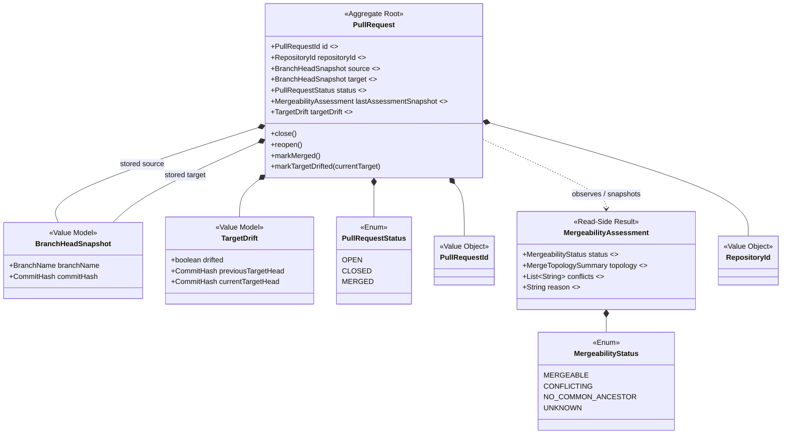
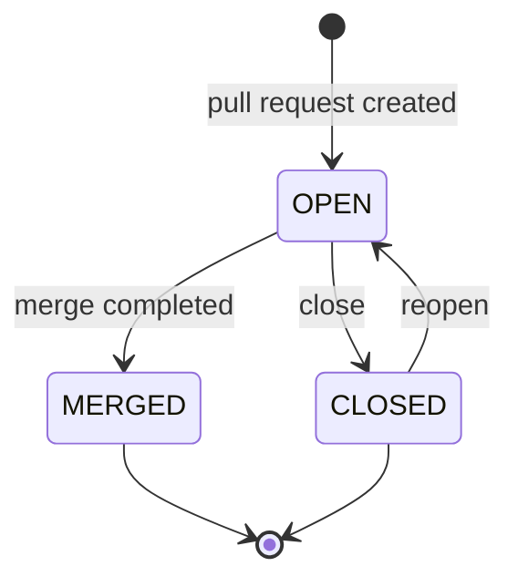
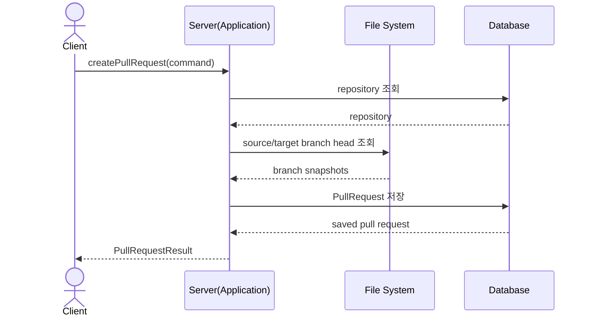
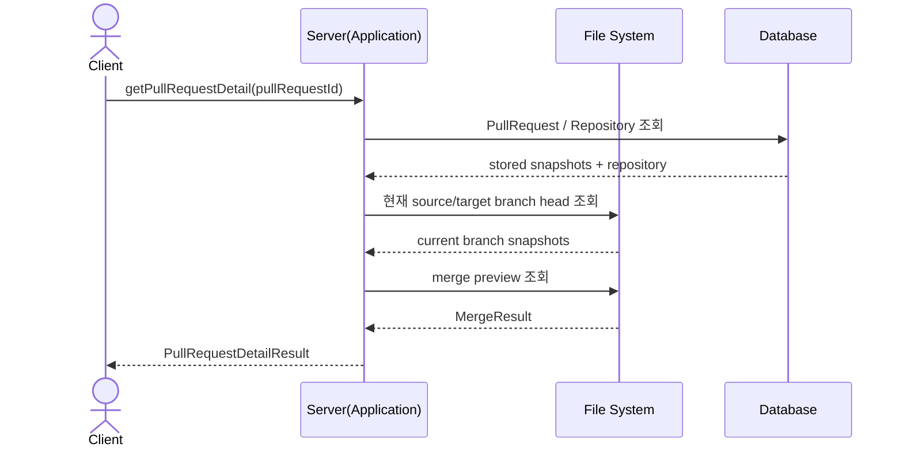
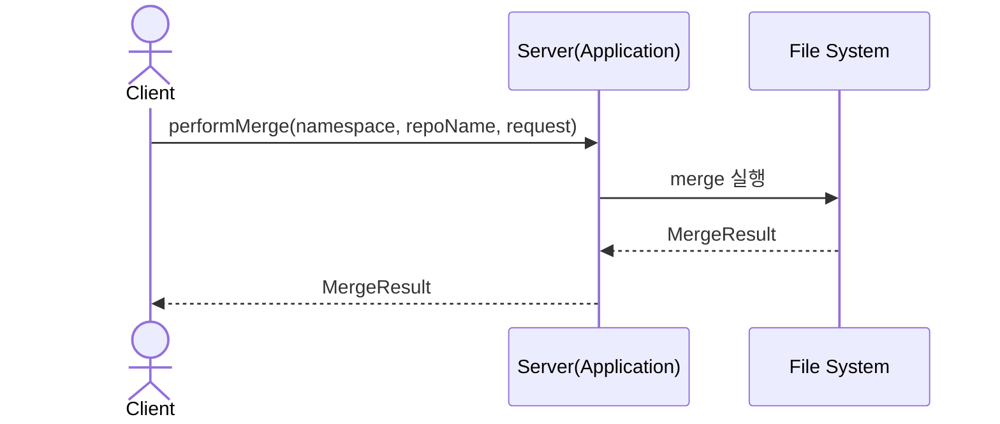

## Change & Review Context Diagrams

### TOC

- [목적](#목적)
- [Aggregate 구조 다이어그램](#aggregate-구조-다이어그램)
- [상태 전이 다이어그램](#상태-전이-다이어그램)
- [Pull Request 생성 시퀀스 다이어그램](#pull-request-생성-시퀀스-다이어그램)
- [Pull Request 상세 조회 시퀀스 다이어그램](#pull-request-상세-조회-시퀀스-다이어그램)
- [Merge 수행 시퀀스 다이어그램](#merge-수행-시퀀스-다이어그램)

### 목적

`Change & Review Context`의 구조와 흐름을 정리한 문서다. 본문은 [Change & Review Context](./context.md)를 참고한다.

### Aggregate 구조 다이어그램

`Change & Review Context`의 aggregate, 내부 값 모델, read-side 결과 경계를 나타낸다.
- `persisted`: 저장 대상
- `persisted optional`: 도메인 모델에는 있으나 현재 구현에서 항상 저장하지는 않음
- `computed`: 조회 시 계산값
- `markMerged()`: merge command 자체가 아니라 aggregate 상태 전이 메서드다.

### 상태 전이 다이어그램

상태는 `OPEN`, `CLOSED`, `MERGED`다.

### Pull Request 생성 시퀀스 다이어그램

Pull Request는 branch 자체가 아니라 생성 시점 source/target snapshot을 저장한다.

애플리케이션 내부에서는 repository 경로 해석, branch head 조회, `PullRequest.create(...)` 호출을 수행한다.

- persisted
  - `repositoryId`
  - source branch name / source head
  - target branch name / target head
  - `status=OPEN`
  - `createdAt`, `updatedAt`
- computed
  - 없음

### Pull Request 상세 조회 시퀀스 다이어그램

<!-- TODO: compute 부분을 섹션으로 표기해서 보여줘도 좋을 것 같아 -->

상세 조회는 저장된 기준점과 현재 Git 상태를 함께 반환한다.

애플리케이션 내부에서는 `TargetDrift` 계산과 `MergeabilityAssessment` 조합을 수행한다.

- persisted
  - 기존 `PullRequest`
  - stored source snapshot
  - stored target snapshot
  - `status`
- computed
  - current source snapshot
  - current target snapshot
  - `TargetDrift`
  - `MergeabilityAssessment`
  - 충돌 파일 목록
  - fast-forward 가능 여부
  - merge commit 필요 여부

### Merge 수행 시퀀스 다이어그램

현재 구현은 merge command와 결과 반환까지만 연결한다. merge 성공 후 `MERGED` 상태 저장은 별도 유스케이스로 통합되지 않았다.

- persisted
  - 현재 구현 기준 없음
- computed
  - `MergeResult`
  - new commit id
  - result tree id
  - 충돌 파일 목록
