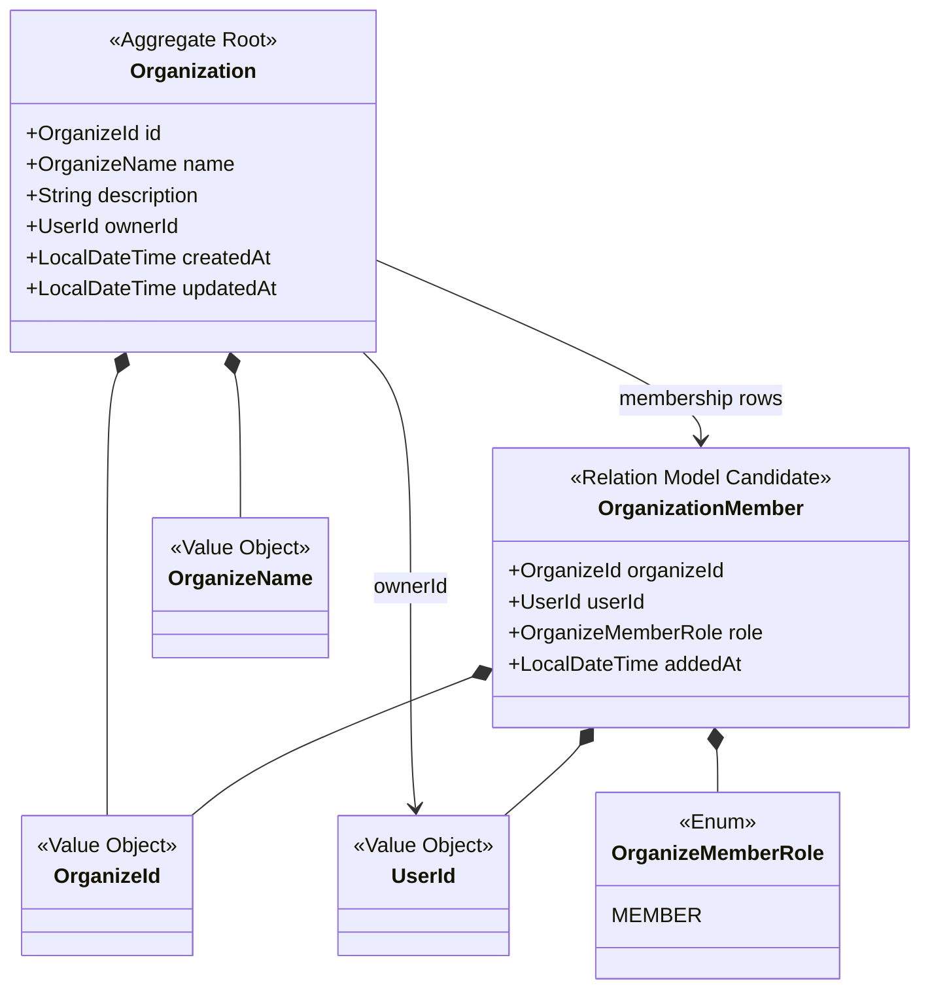
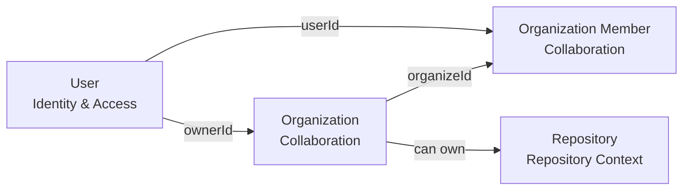
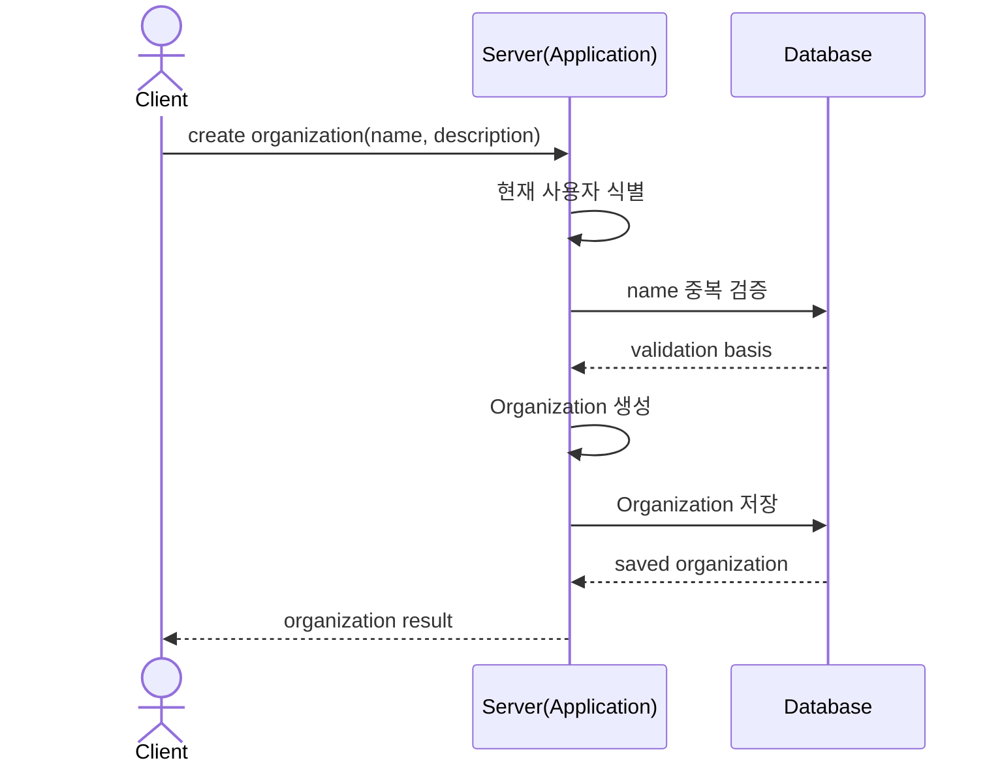
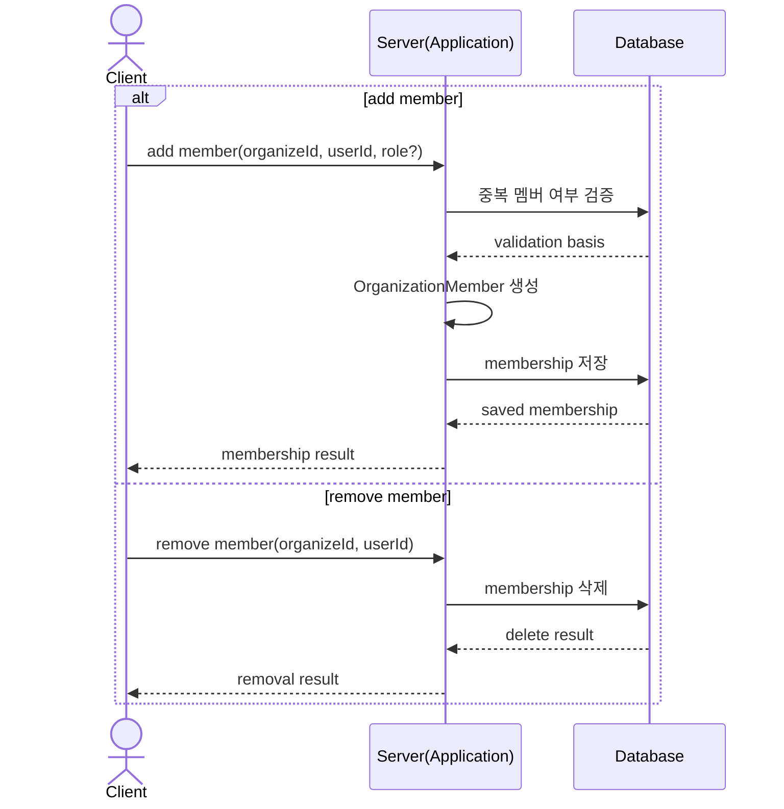
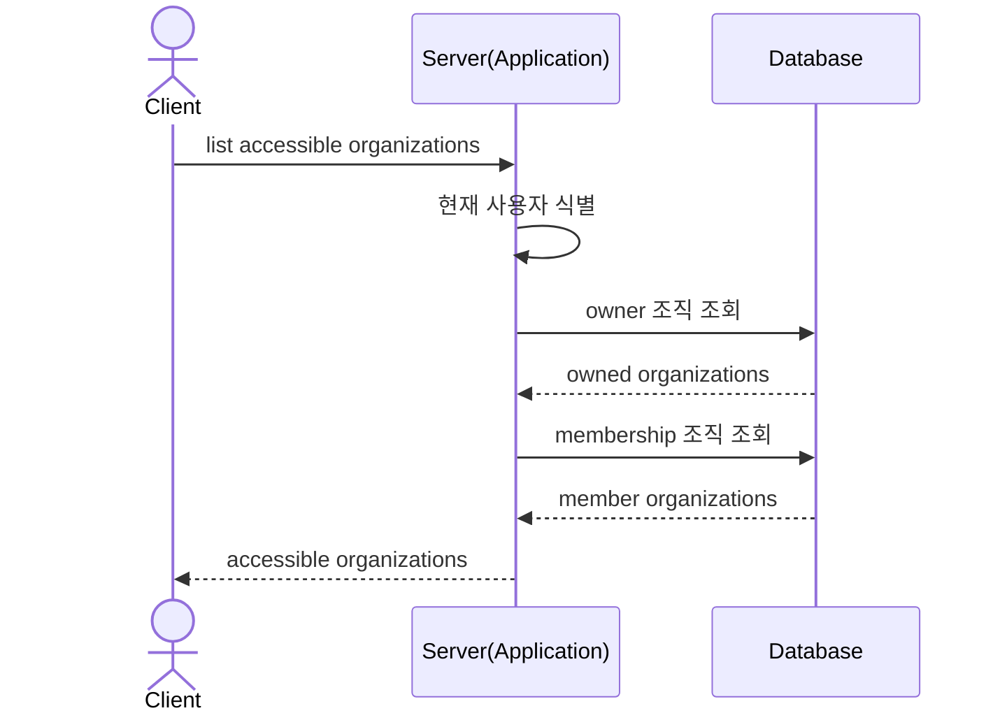

## Collaboration Context Diagrams

### TOC

- [목적](#목적)
- [Aggregate 구조 다이어그램](#aggregate-구조-다이어그램)
- [관계 다이어그램](#관계-다이어그램)
- [Organization 생성 시퀀스 다이어그램](#organization-생성-시퀀스-다이어그램)
- [Organization Member 추가 / 제거 시퀀스 다이어그램](#organization-member-추가--제거-시퀀스-다이어그램)
- [접근 가능 Organization 조회 시퀀스 다이어그램](#접근-가능-organization-조회-시퀀스-다이어그램)

### 목적

`Collaboration Context`의 구조와 흐름을 정리한 문서다. 본문은 [Collaboration Context](./collaboration-context.md)를 참고한다.

### Aggregate 구조 다이어그램

현재 구현은 `Organization Member`를 aggregate 내부 collection보다 관계 모델에 가깝게 다룬다.

### 관계 다이어그램

조직은 사용자와 저장소 사이의 협업 단위다.

### Organization 생성 시퀀스 다이어그램

애플리케이션 내부에서는 owner를 현재 사용자로 결정하고 `Organize.create(...)`를 호출한다.

- persisted
  - `Organization`
  - `ownerId`
  - `name`
- computed
  - 없음

### Organization Member 추가 / 제거 시퀀스 다이어그램

role이 없으면 기본값 `MEMBER`를 사용한다.

### 접근 가능 Organization 조회 시퀀스 다이어그램

현재 접근 가능 여부는 owner 또는 member 여부를 기준으로 계산한다.
