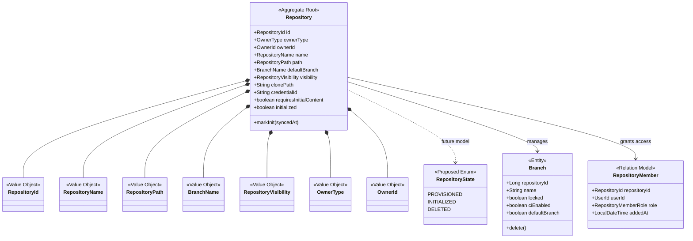
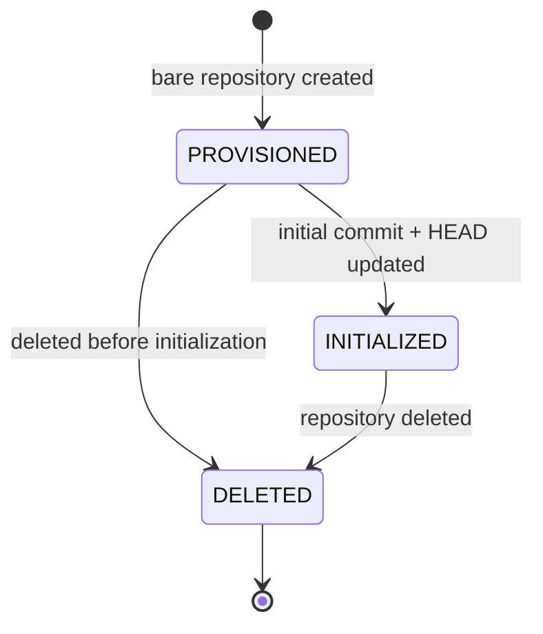
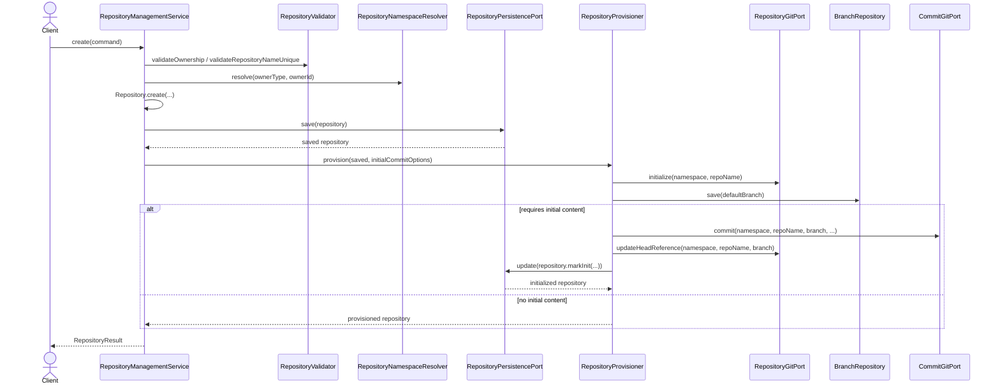

## Repository Context Diagrams

### TOC

- [목적](#목적)
- [Aggregate 구조 다이어그램](#aggregate-구조-다이어그램)
- [상태 전이 다이어그램](#상태-전이-다이어그램)
- [생성 / 초기화 시퀀스 다이어그램](#생성--초기화-시퀀스-다이어그램)

### 목적

`Repository Context`의 구조와 흐름을 정리한 문서다. 본문은 [Repository Context](./repository-context.md)를 참고한다.

### Aggregate 구조 다이어그램

`Repository Context`의 root, 내부 Entity, 관계 모델 경계를 나타낸다. `RepositoryMember`는 내부 Entity가 아니라 관계 모델이다.

### 상태 전이 다이어그램

상태 모델은 `PROVISIONED`, `INITIALIZED`, `DELETED`다. 현재 구현은 `initialized` boolean 중심이다.

### 생성 / 초기화 시퀀스 다이어그램

`RepositoryManagementService`가 aggregate를 생성·저장하고, `RepositoryProvisioner`가 Git 초기화와 기본 브랜치 생성, 선택적 초기 commit 반영을 처리한다.
