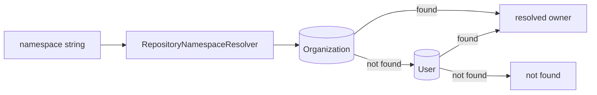
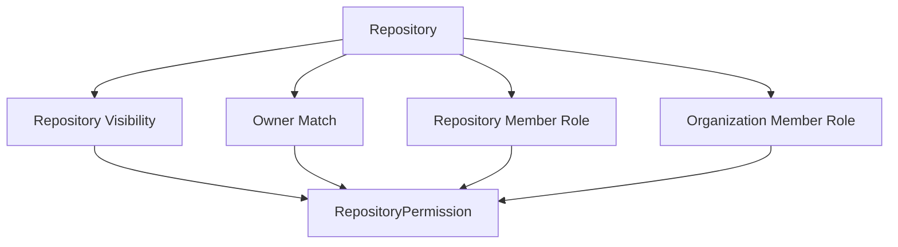
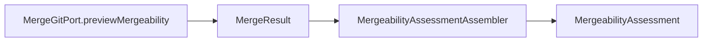
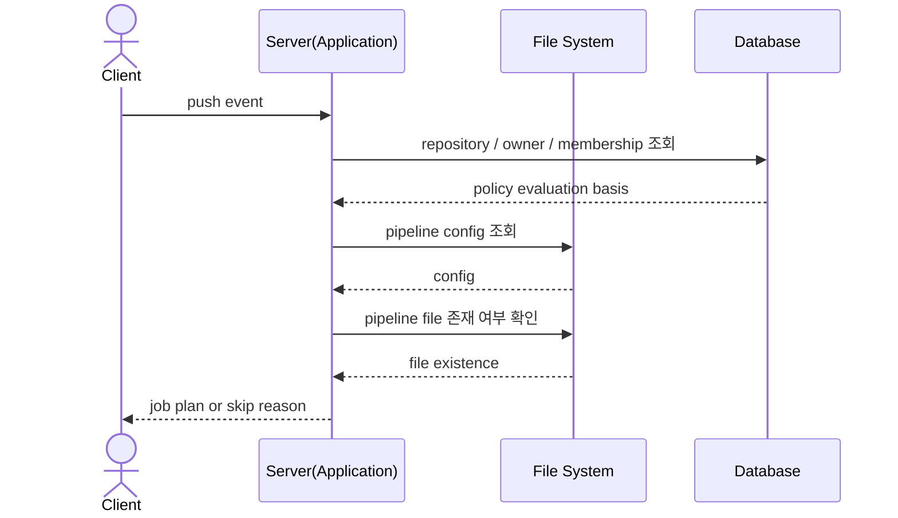

## Shared / Cross-Cutting Topics Diagrams

### TOC

- [목적](#목적)
- [분류 다이어그램](#분류-다이어그램)
- [Namespace 해석 다이어그램](#namespace-해석-다이어그램)
- [Repository Access Resolution 다이어그램](#repository-access-resolution-다이어그램)
- [Mergeability Assessment 다이어그램](#mergeability-assessment-다이어그램)
- [Push 기반 Pipeline Policy 시퀀스 다이어그램](#push-기반-pipeline-policy-시퀀스-다이어그램)

### 목적

여러 context를 함께 관통하는 계산 규칙과 읽기 모델의 구조를 정리한 문서다. 본문은 [Shared / Cross-Cutting Topics](./shared-cross-cutting-topics.md)를 참고한다.

### 분류 다이어그램

```mermaid
flowchart TD
    Shared[Shared Value Object / Policy]
    ReadModel[Read-Side Result]
    Resolver[Application-Level Resolver / Policy]

    Shared --> Namespace[Namespace]
    Shared --> Lookup[Repository Lookup Rule]
    ReadModel --> Permission[RepositoryPermission]
    ReadModel --> Mergeability[MergeabilityAssessment]
    ReadModel --> Topology[MergeTopologySummary]
    Resolver --> NamespaceResolver[RepositoryNamespaceResolver]
    Resolver --> LookupService[RepositoryLookupService]
    Resolver --> AccessService[GitRepositoryAccessService]
    Resolver --> MergeAssembler[MergeabilityAssessmentAssembler]
    Resolver --> PushPolicy[PushJobCreationPolicy]
    Resolver --> EventPolicy[EventPolicyResolver]
```

이 문서는 aggregate보다 정책, resolver, 읽기 모델을 다룬다.

`Pipeline Policy`는 `Execution Context`가 사용하지만, 현재 구현에서는 application-level policy로 배치된다.

### Namespace 해석 다이어그램

현재 구현은 organize 우선, user 차선 순서다.

### Repository Access Resolution 다이어그램

접근 권한은 저장 상태를 조합해 계산하는 결과다.

### Mergeability Assessment 다이어그램

`MergeabilityAssessment`는 저장 모델이 아니라 조회 시 조합되는 읽기 결과다.

### Push 기반 Pipeline Policy 시퀀스 다이어그램

애플리케이션 내부에서는 branch rule 매칭과 실행 가능 여부 판정을 수행한다.

- persisted
  - repository / owner / membership
- external input
  - pipeline config
  - pipeline file
- computed
  - `RepositoryPermission`
  - `MergeabilityAssessment`
  - push event별 `JobPlan` 또는 skip reason
