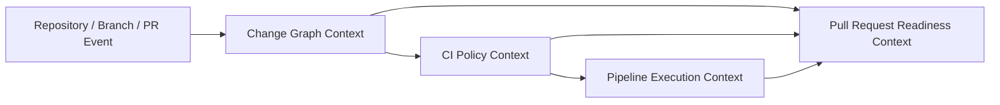

# Domain Modeling Map

## 목적
- `jgitkins`의 SCM/CI 제품 모델을 bounded context 기준으로 빠르게 훑는 인덱스 문서다.
- 특히 병합이라는 도메인을 단순 Git 명령이 아니라 사용자에게 설명 가능한 제품 개념으로 고정하는 데 목적이 있다.
- 각 context 문서의 입구 역할을 하며, 상세 규칙은 개별 문서에서 다룬다.

## 전체 맵
`jgitkins`의 v1 도메인은 아래 4개 bounded context로 나눈다.

1. Change Graph Context
2. CI Policy Context
3. Pipeline Execution Context
4. Pull Request Readiness Context

핵심 흐름은 다음과 같다.

## 왜 이렇게 나누는가
- Change Graph는 병합 의미를 해석한다.
- CI Policy는 어떤 이벤트에서 어떤 파이프라인이 선택되는지 결정한다.
- Pipeline Execution은 실제 실행과 결과 보고를 담당한다.
- Pull Request Readiness는 위 세 결과를 합쳐 사용자에게 보여줄 최종 상태를 만든다.

이 구분이 무너지면 controller나 service가 mergeability, policy match, job execution 결과를 한 번에 섞게 되고, PR 화면과 future CLI가 서로 다른 진실을 말하게 된다.

## 유비쿼터스 언어
- `Pull Request Route`
  - `source -> target` 관계로 표현되는 병합 경로다.
- `Mergeability`
  - 지금 시점에 source가 target으로 들어갈 수 있는지에 대한 상태다.
- `Source Validation`
  - source 브랜치 자체가 건강한지 확인하는 검증이다.
- `Post-change Verification`
  - 병합 또는 direct push 이후 target 브랜치 결과 상태를 검증하는 실행이다.
- `Readiness`
  - source validation과 mergeability를 조합한 PR의 최종 준비 상태다.
- `Policy Match`
  - 주어진 event/source/target 조건에서 어떤 CI 정책이 선택되었는지에 대한 결과다.

## 문서 목록
- [Change Graph Context](./change-graph-context.md)
- [CI Policy Context](./ci-policy-context.md)
- [Pipeline Execution Context](./pipeline-execution-context.md)
- [Pull Request Readiness Context](./pull-request-readiness-context.md)

## 병합 도메인을 먼저 다루는 이유
- 이 제품의 차별점은 Jenkins 친화성만이 아니라, 병합과 변경 흐름의 의미를 사용자가 이해할 수 있게 만드는 데 있다.
- 따라서 `mergeability`, `fast-forward`, `merge commit 필요 여부`, `충돌`은 execution보다 먼저 모델링되어야 한다.
- CI는 병합 의미 위에 올라간다. 병합 의미가 흐리면 readiness와 policy 설명도 함께 흐려진다.

## 현재 코드 시드
- Change Graph seed
  - `server/.../MergeService.java`
  - `server/.../MergeController.java`
  - `server/.../infrastructure/adapter/git/MergeGitAdapter.java`
- CI Policy seed
  - `server/.../PushJobCreationPolicy.java`
  - `server/.../PipelineConfigGitAdapter.java`
  - `server/.../EventPolicyResolver.java`
- Pipeline Execution seed
  - `server/.../JobDispatchService.java`
  - `runner/.../RunnerJobService.java`
- Readiness seed
  - `server/.../PullRequestReadinessAssembler.java`
  - `server/.../dto/readiness/*`

## 문서 사용 원칙
- 이 문서는 구현 클래스명과 1:1로 고정되는 규약 문서가 아니다.
- 다만 새 기능을 추가할 때 “이 책임이 어느 context에 속하는가”를 판단하는 기준 문서로 사용한다.
- 구현이 문서와 어긋나면, 문서가 틀렸는지 코드가 경계를 넘었는지를 먼저 검토한다.
