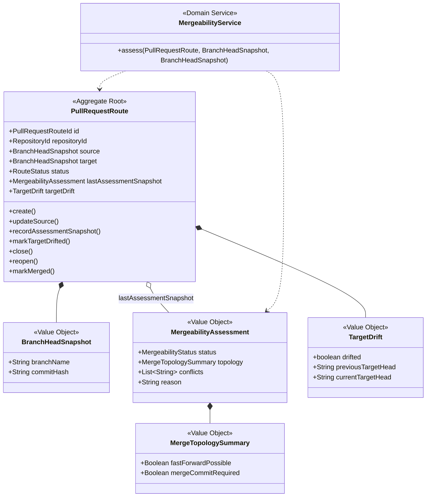

# Change Graph Context

## 목적
- 저장소의 변경 관계와 병합 의미를 해석하는 context다.
- 이 context는 Git 내부 기계어를 제품 언어로 번역한다.
- 사용자는 이 context를 통해 “지금 어디에 있고, 어디로 가려는지, 왜 막혔는지”를 이해한다.

## 핵심 질문
- source와 target의 현재 관계는 무엇인가?
- 지금 병합 가능한가?
- fast-forward가 가능한가?
- merge commit이 필요한가?
- 충돌이 발생하는가?
- target이 움직여서 PR이 stale해졌는가?

## 유비쿼터스 언어
- `Pull Request Route`
  - `source -> target` 관계를 표현하는 병합 경로.
- `Branch Head Snapshot`
  - 특정 시점의 branch head와 commit identity를 표현하는 스냅샷.
- `Mergeability Assessment`
  - 병합 가능 여부와 충돌, merge 방식 가능성을 요약한 결과.
- `Target Drift`
  - PR이 열려 있는 동안 target branch head가 이동한 상태.
- `Merge Topology Summary`
  - fast-forward 가능 여부, merge commit 필요 여부를 설명하는 요약.

## Subdomain Classification
- Type: Core Domain
- Why:
  - `jgitkins`의 제품 차별점은 병합과 변경 흐름을 설명 가능한 언어로 바꾸는 데 있다.
  - 따라서 이 context는 단순 supporting logic이 아니라 제품 핵심 문제를 담당한다.

## 책임
- branch/commit 관계 해석
- source/target mergeability 계산
- conflict detection 결과 해석
- merge 방법 설명
- target drift 감지
- PR merge-side 상태 생성
- PR 경로의 영속 상태와 현재 Git 계산 결과의 경계 정의

## 책임 밖
- 어떤 파이프라인을 실행할지 결정하지 않음
- runner를 선택하거나 job을 생성하지 않음
- Jenkinsfile을 파싱하지 않음
- 사용자 승인 권한을 판단하지 않음
- PR 상세 화면의 최종 readiness를 조합하지 않음

## 주요 입력
- repository namespace / repo name
- source branch
- target branch
- branch head commit
- merge preview 요청 또는 PR 이벤트
- 저장된 `PullRequestRoute`

## 주요 출력
- `MergeabilityAssessment`
- `MergeTopologySummary`
- `TargetDriftDetected`
- `PullRequestRoute`

## Aggregate
### Aggregate Root
- `PullRequestRoute`
  - 하나의 repository 안에서 `source -> target` 병합 경로의 영속 상태를 대표한다.
  - PR 생성, 닫기, 다시 열기, 병합 완료 표시처럼 이력성과 업무 상태가 필요한 행위를 관리한다.
  - 현재 mergeability 계산 결과를 소유하지 않는다. 필요하면 마지막 계산 결과를 snapshot/cache로만 보관한다.

### Entities
- 현재 v1 초안에서는 별도 entity를 강하게 두지 않는다.
- route 내부 상태는 route 자신이 직접 소유하고, 나머지는 값 객체로 둔다.

### Value Objects
- `BranchHeadSnapshot`
- `MergeabilityAssessment`
- `MergeTopologySummary`
- `TargetDrift`

## 영속성과 계산값 경계
### 영속화 대상
- `PullRequestRoute` identity
- repository identity
- source branch / target branch
- route status: `OPEN`, `CLOSED`, `MERGED`
- 생성 시점의 source / target `BranchHeadSnapshot`
- 마지막으로 관측한 source / target `BranchHeadSnapshot`
- target drift 판단에 필요한 기준 snapshot

### 조회 시점 계산 대상
- 현재 source head
- 현재 target head
- `MergeabilityAssessment`
- `MergeTopologySummary`
- conflict paths
- no common ancestor 여부

### 원칙
- Git repository가 현재 상태의 source of truth다.
- `MergeabilityAssessment`는 저장된 사실이 아니라 현재 Git 상태를 해석한 결과다.
- `PullRequestRoute`가 assessment를 저장하더라도 그것은 `lastAssessmentSnapshot` 또는 cache이며, merge 가능 여부의 최종 진실로 사용하지 않는다.
- PR 상세 조회와 병합 직전 검사는 항상 Git port를 통해 최신 mergeability를 다시 계산한다.

## 핵심 불변식
- source와 target은 비어 있을 수 없다.
- source와 target은 동일 branch일 수 없다.
- route는 하나의 repository 안에서만 유효하다.
- 닫힌 route만 `reopen()` 가능하다.
- 열린 route만 `markMerged()` 가능하다.
- `MergeabilityAssessment`는 `PullRequestRoute` 상태 전이의 필수 저장값이 아니다.
- 저장된 assessment snapshot은 현재 Git 상태보다 우선할 수 없다.

## Class Diagram

## 병합 상태 초안
| 상태 | 의미 |
|---|---|
| `MERGEABLE` | 지금 바로 병합 가능함 |
| `CONFLICTING` | 병합 시 충돌이 발생함 |
| `NO_COMMON_ANCESTOR` | 공통 조상이 없어 정상적인 병합 경로가 아님 |
| `UNKNOWN` | 아직 계산되지 않았거나 정보를 신뢰할 수 없음 |

## 주요 시나리오
### 1. PR 생성
- source와 target이 정해진다.
- 생성 시점의 source / target branch head snapshot을 저장한다.
- 생성 직후 표시가 필요하면 현재 branch head 기준 mergeability를 계산할 수 있다.
- 계산 결과는 readiness 조합의 입력이며, route의 영속 상태를 대체하지 않는다.

### 2. PR 업데이트
- source branch head가 바뀐다.
- PR 상세 조회 또는 이벤트 처리 시 mergeability를 다시 계산한다.
- target이 그 사이에 변했다면 stale 여부도 함께 반영한다.

### 3. 병합 직전 설명
- UI는 source 위치, target 위치, 병합 가능 여부를 이 context 결과로 설명한다.
- “FF 가능”, “merge commit 필요”, “충돌 발생”은 이 context의 언어다.
- 이 설명은 저장된 snapshot이 아니라 병합 직전 Git 상태를 기준으로 생성한다.

### 4. PR 상세 조회 입력 제공
- PR 상세 조회 유즈케이스는 저장된 `PullRequestRoute`를 먼저 읽는다.
- 그 다음 현재 source / target head를 Git port로 조회하고 mergeability를 계산한다.
- Change Graph Context는 계산된 `MergeabilityAssessment`를 제공하고, 최종 readiness 조합은 Pull Request Readiness Context가 담당한다.

## Domain Service
- `MergeabilityService`
- `TargetDriftDetector`
- `MergeTopologyAnalyzer`

## 현재 코드 시드
- [MergeService.java](/Users/alzar/task/sources/jgitkins/jgitkins/server/src/main/java/io/jgitkins/server/application/service/MergeService.java)
- [MergeController.java](/Users/alzar/task/sources/jgitkins/jgitkins/server/src/main/java/io/jgitkins/server/presentation/api/rest/MergeController.java)
- [MergeGitAdapter.java](/Users/alzar/task/sources/jgitkins/jgitkins/server/src/main/java/io/jgitkins/server/infrastructure/adapter/git/MergeGitAdapter.java)

## 현재 모델의 약점
- 현재는 `MergeResult`가 기술 결과와 제품 의미를 같이 들고 있다.
- fast-forward 가능 여부와 merge commit 필요 여부는 아직 1급 모델로 분리되지 않았다.
- stale target 개념이 아직 명시적이지 않다.
- PR route 영속 모델과 조회 시점 계산 모델이 아직 코드에서 분리되지 않았다.

## 다음 리팩터링 힌트
- `MergeResult`를 당장 없애기보다, 그 위에 `MergeabilityAssessment` 읽기 모델을 얹는 쪽이 안전하다.
- PR 기능이 생기면 `PullRequestRoute`를 먼저 영속 Aggregate로 올리고, `TargetDrift`는 route의 snapshot 비교 결과로 도입한다.
- `PullRequestLoadUseCase`보다 `GetPullRequestDetailUseCase`처럼 조회 목적이 드러나는 이름을 우선 검토한다.
- PR 상세 조회에서는 저장된 route와 현재 Git 계산값을 조합하되, Change Graph Context는 mergeability 해석까지만 책임진다.
