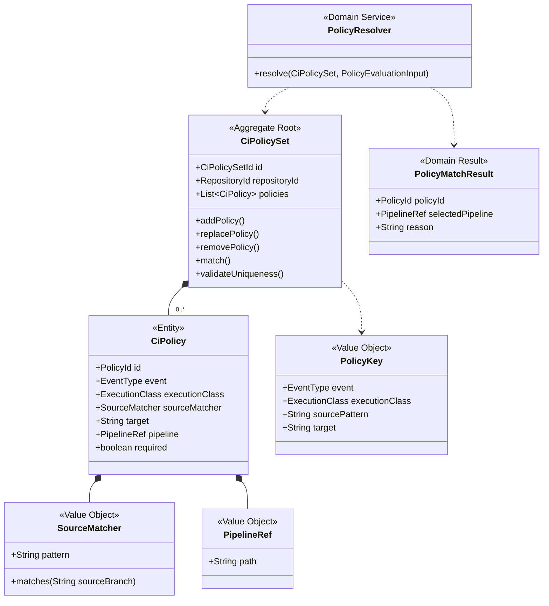

# CI Policy Context

## 목적
- 어떤 이벤트에서 어떤 파이프라인이 실행되어야 하는지 결정하는 context다.
- source/target/event와 `ci.yml`을 해석해서 “job을 만들어야 하는가”를 답한다.

## 핵심 질문
- 이 이벤트에서 policy가 매칭되는가?
- 어떤 Jenkins-compatible pipeline을 선택해야 하는가?
- 이 정책은 source validation인가, post-change verification인가?
- 왜 이 job이 생성되었는가?

## 유비쿼터스 언어
- `Policy`
  - event, source, target, pipeline을 가진 선언 규칙.
- `Policy Match`
  - 현재 입력에 대해 어떤 policy가 선택되었는지에 대한 결과.
- `Source Matcher`
  - `*`, `feature/*`, exact branch 등 source branch 패턴 규칙.
- `System Default Rule`
  - 사용자가 선언하지 않아도 항상 적용되는 내장 규칙.
- `Job Plan`
  - policy 해석 결과로 생성되는 실행 계획.

## Subdomain Classification
- Type: Core Domain
- Why:
  - 이 제품에서는 정책이 단순 CI 설정이 아니라 SCM 의미와 직접 연결된다.
  - source/target/event를 어떻게 해석하느냐가 실행 설명성과 직결되므로 core에 가깝다.

## 책임
- `ci.yml` 로딩
- 스키마 해석
- policy uniqueness 검증
- source pattern matching
- event/source/target 기준 pipeline 선택
- skip reason 계산
- mergeability check 시스템 기본 규칙 보존

## 책임 밖
- Git graph 해석 자체는 하지 않음
- 충돌 계산 자체는 하지 않음
- 실제 job 실행은 하지 않음
- UI용 최종 readiness는 직접 조합하지 않음

## 주요 입력
- event type
- source branch
- target branch
- commit hash
- repository config file
- Change Graph context 결과

## 주요 출력
- `PolicyMatchResult`
- `PipelineSelection`
- `JobPlan`
- `NoMatchingPolicyReason`

## Aggregate
### Aggregate Root
- `CiPolicySet`
  - 저장소 단위 정책 묶음의 일관성을 관리한다.

### Entities
- `CiPolicy`
  - event/source/target/pipeline을 가진 개별 규칙.

### Value Objects
- `SourceMatcher`
- `PipelineRef`
- `PolicyKey`

## 핵심 불변식
- 같은 `event + class + source + target` 정책은 중복될 수 없다.
- post-change verification 정책은 `source`를 가질 수 없다.
- pipeline path는 비어 있을 수 없다.
- mergeability check는 사용자 선언과 별개로 system-default rule로 유지된다.

## Class Diagram

## v1 정책 축
### 1. Pre-merge source validation
- source 브랜치 자체 검증용 정책.
- key는 `event + source-pattern + target`.

### 2. Post-change verification
- 병합 후 또는 direct change 이후 target 브랜치 결과 검증용 정책.
- key는 `event + target`.

### 3. System-default mergeability check
- 사용자가 `ci.yml`에 쓰지 않아도 PR에는 항상 적용된다.
- 병합 가능 여부는 정책 옵션이 아니라 제품 기본 약속이다.

## 주요 시나리오
### 1. `pr_opened`
- `source -> target` 기준으로 source validation policy를 찾는다.
- 별도로 mergeability check는 항상 활성화된다.

### 2. `pr_updated`
- source branch head가 바뀐 상태에서 다시 policy를 찾는다.
- 동일 route에 대한 재검증이다.

### 3. `pr_merged`
- target branch post-change verification policy를 찾는다.

### 4. `branch_changed`
- direct push 또는 PR 외 변경에 대한 target verification policy를 찾는다.

## Domain Service
- `PolicyResolver`
- `CiConfigValidator`
- `PipelineSelector`

## 현재 코드 시드
- [PushJobCreationPolicy.java](/Users/alzar/task/sources/jgitkins/jgitkins/server/src/main/java/io/jgitkins/server/application/support/PushJobCreationPolicy.java)
- [PipelineConfigGitAdapter.java](/Users/alzar/task/sources/jgitkins/jgitkins/server/src/main/java/io/jgitkins/server/infrastructure/adapter/git/PipelineConfigGitAdapter.java)
- [EventPolicyResolver.java](/Users/alzar/task/sources/jgitkins/jgitkins/server/src/main/java/io/jgitkins/server/application/support/policy/EventPolicyResolver.java)
- [PipelineConfig.java](/Users/alzar/task/sources/jgitkins/jgitkins/server/src/main/java/io/jgitkins/server/application/dto/pipeline/PipelineConfig.java)

## 현재 모델의 약점
- 현재 구현은 push/branch 중심으로 좁다.
- `pr_opened`, `pr_updated`, `pr_merged`의 route semantics가 아직 policy 모델에 직접 반영되지 않았다.
- parser와 validator가 사실상 느슨한 adapter 수준에 머무른다.

## 다음 리팩터링 힌트
- `PipelineConfigGitAdapter`는 로딩과 파싱을 분리하는 편이 낫다.
- `PushJobCreationPolicy`는 push 전용 이름을 벗고 event-general policy resolver로 확장될 가능성이 높다.
