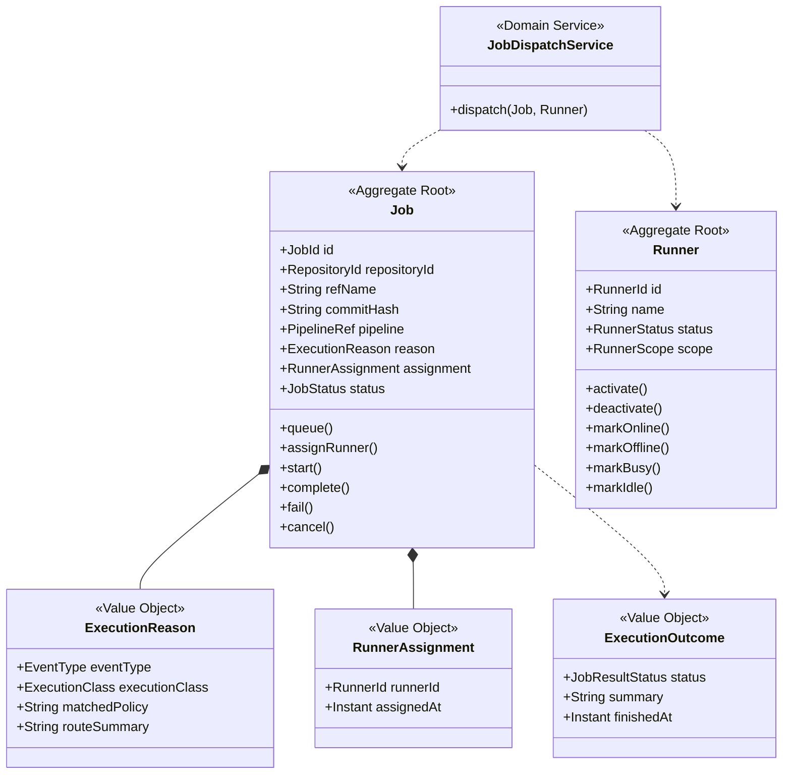

# Pipeline Execution Context

## 목적
- 선택된 pipeline을 실제로 실행하고, runner와 결과 보고를 다루는 context다.
- 정책이 결정한 내용을 현실 세계의 실행으로 바꾸는 계층이다.

## 핵심 질문
- 어떤 runner가 이 job을 실행하는가?
- repository는 어떤 상태로 sync되어야 하는가?
- 어떤 pipeline file을 읽어야 하는가?
- 실행 결과는 무엇이었는가?

## 유비쿼터스 언어
- `Execution Request`
  - 실행에 필요한 repository, ref, pipeline, trigger 정보를 모은 요청.
- `Dispatchable Job`
  - runner가 가져갈 수 있는 상태의 job.
- `Execution Outcome`
  - 성공, 실패, 취소, 에러 등 실행 결과.
- `Runner Assignment`
  - 어느 runner가 어느 job을 수행하는지에 대한 할당 정보.

## Subdomain Classification
- Type: Supporting Domain
- Why:
  - 제품의 wedge에는 중요하지만 장기 차별점의 중심은 병합 의미 해석과 readiness 설명 쪽에 있다.
  - execution은 핵심 가치를 실현하는 supporting capability로 보는 편이 맞다.

## 책임
- job 생성
- runner dispatch
- repository sync
- pipeline file 전달
- 실행 상태 전이
- 결과 보고
- execution audit trail 보존

## 책임 밖
- 병합 가능 여부 판단
- policy 매칭 여부 판단
- PR의 최종 readiness 계산

## 주요 입력
- repository identity
- branch / commit hash
- selected pipeline path
- triggered by
- runner availability

## 주요 출력
- `JobQueued`
- `JobStarted`
- `JobFinished`
- `ExecutionOutcome`
- execution log / report

## Aggregate
### Aggregate Root
- `Job`
- `Runner`

### Entities
- v1에서는 aggregate root 바깥의 entity를 최소화한다.
- `JobHistory`는 `Job` 내부 구성 요소로 시작하는 편이 자연스럽다.

### Value Objects
- `ExecutionRequest`
- `ExecutionOutcome`
- `RunnerAssignment`
- `ExecutionReason`

## 핵심 불변식
- 종료된 job은 다시 시작될 수 없다.
- running 상태의 job만 완료 또는 실패로 전이될 수 있다.
- offline 또는 disabled runner는 dispatch 대상이 될 수 없다.
- runner 상태와 job 상태는 서로 관련되지만 같은 aggregate에 묶지 않는다.

## Class Diagram

## 주요 시나리오
### 1. Push 또는 PR 이벤트 이후 실행 요청 수신
- CI Policy가 넘긴 실행 계획을 바탕으로 job을 생성한다.

### 2. Runner dispatch
- idle runner가 있으면 dispatch 가능한 job을 가져간다.

### 3. Repository sync 및 pipeline 실행
- runner는 repository를 맞는 ref로 sync한다.
- 선택된 Jenkins-compatible pipeline을 실행한다.

### 4. 결과 보고
- 성공/실패/취소/에러를 서버에 보고한다.
- readiness context는 이 결과를 source validation 상태 계산의 입력으로 사용한다.

## Domain Service
- `JobDispatchService`
- `ExecutionRequestService`
- `RunnerJobService`

## 현재 코드 시드
- [JobDispatchService.java](/Users/alzar/task/sources/jgitkins/jgitkins/server/src/main/java/io/jgitkins/server/application/service/JobDispatchService.java)
- [ExecutionRequestService.java](/Users/alzar/task/sources/jgitkins/jgitkins/server/src/main/java/io/jgitkins/server/application/support/execution/ExecutionRequestService.java)
- [RunnerJobService.java](/Users/alzar/task/sources/jgitkins/jgitkins/runner/src/main/java/io/jgitkins/runner/application/service/RunnerJobService.java)
- [GitRepositorySyncAdapter.java](/Users/alzar/task/sources/jgitkins/jgitkins/runner/src/main/java/io/jgitkins/runner/infrastructure/git/GitRepositorySyncAdapter.java)

## 현재 모델의 강점
- execution path는 이미 비교적 분리되어 있다.
- 최근 `PushEventHandleService` 분리로 orchestration seam이 생겼다.
- runner와 server 사이 job lifecycle은 재사용 자산이 충분하다.

## 현재 모델의 약점
- job이 어떤 policy reason으로 생성되었는지 설명성 메타데이터가 약하다.
- PR validation run과 post-change verification run을 구분하는 도메인 언어가 아직 충분하지 않다.

## 다음 리팩터링 힌트
- `ExecutionRequest`에 `execution class`, `policy reason`, `source/target route` 메타데이터가 붙어야 한다.
- 그래야 나중에 UI와 CLI가 “왜 이 job이 돌았는가”를 정확히 설명할 수 있다.
