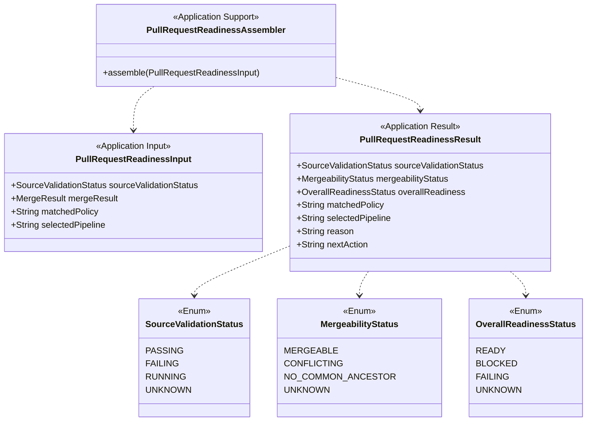

# Pull Request Readiness Context

## 목적
- source validation, mergeability, execution 결과를 조합해 PR의 최종 준비 상태를 만든다.
- 이 context의 결과는 사용자가 UI나 CLI에서 직접 보게 되는 application data의 기준이 된다.

## 핵심 질문
- 이 PR은 지금 merge 가능한 상태인가?
- 왜 `READY`, `BLOCKED`, `FAILING`, `UNKNOWN`인가?
- 다음 사용자가 취해야 할 행동은 무엇인가?

## 유비쿼터스 언어
- `Source Validation Status`
  - source branch 검증 상태.
- `Mergeability Status`
  - 병합 가능 상태.
- `Overall Readiness`
  - source validation과 mergeability를 합친 최종 상태.
- `Reason`
  - 현재 상태의 설명.
- `Next Action`
  - 사용자가 바로 취해야 할 다음 행동.

## Subdomain Classification
- Type: Core Domain
- Why:
  - 사용자가 실제로 신뢰하게 되는 최종 제품 경험은 readiness 설명에서 완성된다.
  - web과 future CLI가 같은 진실을 보여주려면 이 context의 의미가 핵심이 된다.

## 책임
- source validation 상태 정규화
- mergeability 상태 정규화
- overall readiness 계산
- reason / next action 생성
- UI/CLI 공통 결과 형태 유지

## 책임 밖
- mergeability 자체 계산
- policy match 자체 계산
- 실제 pipeline 실행
- presentation 래핑

## 주요 입력
- source validation 결과
- mergeability 결과
- matched policy
- selected pipeline

## 주요 출력
- `PullRequestReadinessResult`
  - `sourceValidationStatus`
  - `mergeabilityStatus`
  - `overallReadiness`
  - `matchedPolicy`
  - `selectedPipeline`
  - `reason`
  - `nextAction`

## Aggregate
### Aggregate Root
- 없음

### 이유
- 이 context는 쓰기 모델의 일관성 경계보다 읽기 조합 경계에 가깝다.
- 따라서 aggregate를 억지로 만들기보다 read model과 assembler 중심으로 두는 편이 자연스럽다.

### Core Models
- `PullRequestReadinessInput`
- `PullRequestReadinessResult`

### Value-like Models
- `SourceValidationStatus`
- `MergeabilityStatus`
- `OverallReadinessStatus`

## 핵심 불변식
- `overallReadiness`는 source validation과 mergeability로부터 파생되어야 한다.
- source validation이 `FAILING`이면 mergeability와 무관하게 overall은 `FAILING`이다.
- source validation이 `RUNNING` 또는 `UNKNOWN`이면 overall은 `UNKNOWN`이다.
- source validation이 `PASSING`이고 mergeability가 `MERGEABLE`일 때만 overall은 `READY`다.

## Class Diagram

## readiness 규칙 초안
| Source validation | Mergeability | Overall readiness |
|---|---|---|
| `PASSING` | `MERGEABLE` | `READY` |
| `PASSING` | `CONFLICTING` | `BLOCKED` |
| `PASSING` | `NO_COMMON_ANCESTOR` | `BLOCKED` |
| `FAILING` | any | `FAILING` |
| `RUNNING` | any | `UNKNOWN` |
| `UNKNOWN` | any | `UNKNOWN` |

## 주요 시나리오
### 1. PR detail 화면
- 사용자는 현재 PR의 overall readiness를 본다.
- 그 아래에서 source validation과 mergeability를 분리해서 확인한다.

### 2. CLI `pr checks`
- 같은 결과를 텍스트 기반으로 출력한다.
- web과 CLI는 같은 readiness result를 다른 포맷으로만 보여준다.

### 3. Merge action gate
- approval/merge action은 readiness 결과를 참고한다.
- 단, merge 권한이나 승인 정책은 이 context 밖의 문제다.

## Domain Service
- `PullRequestReadinessAssembler`

## 현재 코드 시드
- [PullRequestReadinessAssembler.java](/Users/alzar/task/sources/jgitkins/jgitkins/server/src/main/java/io/jgitkins/server/application/support/readiness/PullRequestReadinessAssembler.java)
- [PullRequestReadinessResult.java](/Users/alzar/task/sources/jgitkins/jgitkins/server/src/main/java/io/jgitkins/server/application/dto/readiness/PullRequestReadinessResult.java)
- [PullRequestReadinessInput.java](/Users/alzar/task/sources/jgitkins/jgitkins/server/src/main/java/io/jgitkins/server/application/dto/readiness/PullRequestReadinessInput.java)

## 현재 모델의 약점
- 아직 실제 PR read use case에 연결되지 않았다.
- stale target 상태와 partial failure 상태는 아직 명시적으로 반영되지 않았다.
- reason / next action 문구는 현재 영어 초안 수준이다.

## 다음 리팩터링 힌트
- web에서 raw mergeability와 raw job result를 직접 조합하지 않도록, readiness result를 우선 API 응답 기준으로 삼아야 한다.
- 이후 CLI가 생겨도 같은 result를 재사용하면 된다.
