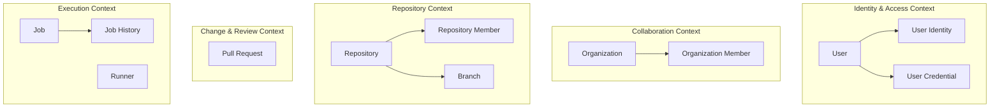

# Domain Overview

## 목적

이 문서는 `jgitkins` 도메인 개념 명세 초안이다. Aggregate 상세 명세 전에 제품 용어의 의미를 고정한다.

## 작성 기준

제품 언어 기준으로 개념을 정의한다. 각 개념에는 의미, 코드 근거, 분류, Aggregate 후보 여부를 기록한다. 테이블명과 클래스명은 근거일 뿐 대표 용어는 아니다.

## 개념 목록

### User

- 정의: `jgitkins`에 로그인하고 저장소, 조직, 자격증명, 실행 요청의 주체가 되는 사람 계정이다.
- 목적: 권한 판단, 소유자 식별, 작업 수행자 추적의 기준이 된다.
- 현재 분류: Entity 또는 Aggregate Root 후보.
- 현재 코드 근거: `server/domain/model/User.java`, `UserIdentity.java`, `UserCredential.java`, `UserAuthority.java`, `UserStatus.java`.
- 현재 테이블 근거: `USER`, `USER_CREDENTIALS`.
- Aggregate 판단: 계정 상태, 인증 identity, credential 생명주기를 어디까지 한 트랜잭션으로 묶을지 정한 뒤 확정한다.
- 주의점: OAuth identity, username, credential은 인증/인가와 SCM 권한 경계에 걸친다.

### User Identity

- 정의: OAuth provider나 외부 인증 시스템에서 온 사용자의 외부 신원이다.
- 목적: 외부 로그인 결과를 내부 User와 연결한다.
- 현재 분류: User 하위 Entity 후보.
- 현재 코드 근거: `server/domain/model/UserIdentity.java`, `OAuthLoginUseCase`, `OAuthLoginService`.
- Aggregate 판단: 현재는 User 내부 Entity 후보로 본다.
- 주의점: 현재는 OAuth 로그인으로 사용자를 생성한다. 내부 username과 외부 display name을 섞으면 namespace 계산이 흔들린다.
- 용어 주의: User Identity는 User의 하위도메인이 아니다. Subdomain은 Identity & Access, SCM, CI Execution처럼 더 큰 비즈니스 능력 단위에 사용한다.

### User Credential

- 정의: 사용자가 Git 접근, API 호출, 자동화 등에 사용할 수 있는 개인 자격증명이다.
- 목적: OAuth 로그인 뒤 사용자가 clone, push, pull 같은 형상관리 작업이나 API 호출에 사용할 personal access token을 발급하고 관리하게 한다.
- 현재 분류: User 하위 Entity 후보.
- 현재 코드 근거: `server/domain/model/UserCredential.java`, `UserCredentialIssueUseCase`, `UserCredentialService`.
- 현재 테이블 근거: `USER_CREDENTIALS`.
- Aggregate 판단: 현재는 User 내부 Entity로 본다. 발급, 폐기, 권한 범위, 만료, 사용 이력, 감사 로그가 독립 생명주기가 되면 별도 Aggregate로 승격한다.

### Organization

- 정의: 여러 사용자가 함께 저장소를 소유하고 관리하는 협업 단위다.
- 목적: 개인 소유 저장소와 조직 소유 저장소를 구분하고, 조직 멤버십과 권한을 관리한다.
- 현재 분류: Aggregate Root.
- 현재 코드 근거: `server/domain/aggregate/Organize.java`, `OrganizeMember.java`, `OrganizeCreationUseCase`, `OrganizeMember*UseCase`.
- 현재 테이블 근거: `ORGANIZE`, `ORGANIZE_MEMBER`.
- Aggregate 판단: `Organize`가 root이며, 조직 멤버십을 같은 Aggregate 내부 Entity로 볼지 별도 관계 Aggregate로 볼지 후속 명세가 필요하다.
- 주의점: 코드명은 `Organize`지만 문서 용어는 `Organization`을 쓴다.

### Organization Member

- 정의: 특정 Organization에 속한 사용자와 그 역할이다.
- 목적: 조직 단위 권한 부여와 저장소 관리 권한의 근거가 된다.
- 현재 분류: Entity 또는 관계 모델.
- 현재 코드 근거: `server/domain/model/OrganizeMember.java`, `OrganizeMemberRole.java`.
- 현재 테이블 근거: `ORGANIZE_MEMBER`.
- Aggregate 판단: 조직 멤버 추가/삭제가 Organization의 불변식에 묶이면 Organization Aggregate 내부 Entity로 본다.
- 관계 메모: `Organization Member`와 `Repository Member`는 같은 `Membership` 패턴의 scope별 변형이다.

### Repository

- 정의: Git 저장소와 jgitkins 관리 메타데이터를 함께 나타내는 핵심 작업 공간이다.
- 목적: 소스 코드, 브랜치, 파일, 커밋, CI 정책, PR, 실행 이력을 연결하는 중심 식별자다.
- 현재 분류: Aggregate Root.
- 현재 코드 근거: `server/domain/aggregate/Repository.java`, `RepositoryCreateUseCase`, `RepositoryLoadUseCase`, `RepositoryManagementService`.
- 현재 테이블 근거: `REPOSITORY`.
- 주요 값: `RepositoryId`, `RepositoryName`, `RepositoryPath`, `RepositoryVisibility`, `OwnerType`, `OwnerId`, `BranchName`.
- Aggregate 판단: Repository는 root다. 생성 시 owner, 경로, 기본 브랜치, 가시성, clone path, credential, 초기화 필요 여부를 함께 결정한다. Branch, FileTree, Commit은 Git에서 온 외부 상태다.
- 주의점: 저장소 메타데이터와 실제 Git object graph는 생명주기와 저장소가 다르다.
- 핵심 불변식 후보: owner 범위 안에서 repository name은 중복될 수 없다. 초기 commit 없이 bare repository만 생성된 상태에서는 `initialized=false`이며, 이 상태에서는 새 브랜치를 만들 수 없다.

### Repository Member

- 정의: 특정 Repository에 접근할 수 있는 사용자와 그 역할이다.
- 목적: 저장소별 협업 권한을 표현한다.
- 현재 분류: Entity 또는 관계 모델.
- 현재 코드 근거: `server/domain/model/RepositoryMember.java`, `RepositoryMemberRole.java`, `RepositoryMember*UseCase`.
- 현재 테이블 근거: `REPOSITORY_MEMBER`.
- Aggregate 판단: 현재는 Repository 내부 Entity보다 Repository와 User 사이의 관계 모델로 본다.
- 관계 메모: `Organization Member`와 `Repository Member`는 공통 Membership 패턴이지만 role vocabulary가 다르다.

### Branch

- 정의: Repository 안에서 특정 변경 흐름을 가리키는 Git branch와 jgitkins의 branch 메타데이터다.
- 목적: 파일/커밋 조회, push event, PR source/target, CI 실행의 기준점이 된다.
- 현재 분류: Entity 후보.
- 현재 코드 근거: `server/domain/Branch.java`, `BranchName.java`, `BranchCreateUseCase`, `BranchLoadUseCase`, `BranchManagementService`.
- 현재 테이블 근거: `BRANCH`.
- Aggregate 판단: Branch는 `repositoryId`를 소유자 식별자로 가지며 기본 브랜치 삭제 금지 같은 규칙도 Repository 문맥에서 해석된다. 현재는 Repository에 종속된 Entity로 본다.
- 핵심 불변식 후보: 기본 브랜치는 삭제할 수 없다. 같은 Repository 안에서 branch name은 중복될 수 없다.

### Pull Request

- 정의: 한 Repository 안에서 source branch의 변경을 target branch로 합치려는 요청이다.
- 목적: 변경 검토, 병합 가능성 확인, CI 결과 조합, 최종 readiness 판단의 중심이 된다.
- 현재 분류: Aggregate Root.
- 현재 코드 근거: `server/domain/pr/aggregate/PullRequest.java`, `CreatePullRequestUseCase`, `GetPullRequestDetailUseCase`, `PullRequestService`.
- 현재 테이블 근거: `PULL_REQUEST`.
- 주요 값: `PullRequestId`, `BranchHeadSnapshot`, `PullRequestStatus`, `TargetDrift`.
- Aggregate 판단: PR의 영속 상태와 source/target snapshot은 PullRequest Aggregate가 책임진다. mergeability는 조회 시점 계산값이다.
- 핵심 불변식 후보: source와 target branch는 같을 수 없다. 열린 PR만 source 갱신, assessment 기록, target drift 기록, merge/close가 가능하다. 닫힌 PR만 reopen 가능하다.

### Job

- 정의: 특정 Repository, branch, commit에 대해 실행해야 하는 CI 작업 요청이다.
- 목적: 실행 대상을 식별하고, runner dispatch와 결과 보고의 기준이 된다.
- 현재 분류: Aggregate Root.
- 현재 코드 근거: `server/domain/aggregate/Job.java`, `JobHistory.java`, `JobCreateUseCase`, `JobDispatchUseCase`, `JobResultReportUseCase`.
- 현재 테이블 근거: `JOB`, `JOB_HISTORY`.
- Aggregate 판단: Job이 root이고 JobHistory는 내부 Entity로 보는 현재 모델이 자연스럽다.
- 핵심 불변식 후보: Job은 최소 하나의 history를 가진다. PENDING 상태에서만 큐잉할 수 있고, IN_PROGRESS 상태에서만 성공/실패 완료할 수 있다.

### Job History

- 정의: Job 상태가 시간에 따라 변한 기록이다.
- 목적: 대기, 실행, 성공, 실패 상태와 실행 runner, 로그 위치를 남긴다.
- 현재 분류: Entity.
- 현재 코드 근거: `JobHistory.java`, `JobHistoryId.java`, `JobStatus.java`.
- 현재 테이블 근거: `JOB_HISTORY`.
- Aggregate 판단: Job Aggregate 내부 Entity로 본다.

### Runner

- 정의: 서버에서 할당한 Job을 실제 환경에서 실행하는 작업자다.
- 목적: 실행 용량, scope, activation token, heartbeat, 실행 가능 상태를 관리한다.
- 현재 분류: Aggregate Root.
- 현재 코드 근거: server의 `Runner.java`, runner 모듈의 `RunnerConfiguration.java`, `RunnerActivationUseCase`, `RunnerJobUseCase`.
- 현재 테이블 근거: `RUNNER`, `RUNNER_ASSIGNMENT`.
- Aggregate 판단: 서버 관점의 Runner 등록/활성화는 Aggregate Root다. runner 프로세스 내부 runtime config는 별도 실행 컨텍스트다.
- 핵심 불변식 후보: runner 등록에는 description과 scope가 필요하다. activation token이 일치해야 활성화할 수 있다. 이미 offline이 아닌 runner는 다시 activate할 수 없다.

상단 개념 목록은 Aggregate Root와 Entity 중심으로 유지한다. Value Object, Read Model, 계산 결과, 외부 시스템 개념, bounded context 수준 개념은 아래 표에서 별도로 정리한다.

## 전체 도메인 개요 맵



이 맵은 Aggregate Root와 주요 Entity 경계만 보여준다. Value Object, Read Model, 계산 결과, 외부 시스템 개념, 미확정 후보는 제외한다.

## 그래프에서 제외한 주요 개념

| 개념 | 분류 | 이유 |
| --- | --- | --- |
| Namespace | Value Object + 해석 규칙 | User/Organization의 전역 owner slug이며 저장소 경계 해석에 사용한다. |
| Repository Path | Value Object | 저장소 slug 정규화와 형식 검증만 담당한다. |
| Commit | External/System Concept | Git object이며 jgitkins 내부 영속 Aggregate가 아니다. |
| File Tree | Read Model | Git tree 조회 결과다. |
| File Content | Read Model 또는 command input | Git blob 조회 또는 업로드 입력이다. |
| Diff | Read Model 또는 계산 결과 | 두 ref 사이의 차이를 계산한 결과다. |
| Change Graph | Domain Service 중심 모델 | branch 관계를 해석하는 계산 컨텍스트다. |
| Mergeability Assessment | Domain Service 결과 | 조회 시점 판단 결과다. |
| CI Policy | Aggregate 후보 | 현재는 repository config 기반 정책 해석 모델에 가깝다. |
| Pipeline Config | External Config | 현재는 Git 안의 설정 파일이다. |
| Pipeline Execution | Bounded Context | Job/Runner 위에서 실행 흐름을 표현하는 컨텍스트다. |
| Execution Result | Value Object 또는 command result | 실행 완료 후 보고되는 결과값이다. |
| Pull Request Readiness | Read Model 및 Domain Service 결과 | 여러 컨텍스트 결과를 조합한 최종 상태다. |

`Namespace`는 Entity나 Aggregate보다 shared value object와 policy/service 조합으로 본다. 권장 패키지 예시는 다음과 같다.

```text
server/domain/shared/
  namespace/
    Namespace.java
    NamespacePolicy.java
    NamespaceAvailabilityChecker.java
```

필요하면 `NamespaceResolver.java`를 추가해 owner를 namespace로 해석하는 역할을 분리한다.

## 1차 Aggregate 후보 표

| 후보 | 현재 판단 | 근거 | 후속 명세 우선순위 |
| --- | --- | --- | --- |
| Repository | Aggregate Root | 저장소 메타데이터와 생성/초기화 생명주기 보유 | 높음 |
| Organization | Aggregate Root | 조직 생성과 멤버십 경계 보유 | 중간 |
| User | Aggregate Root 후보 | 인증, 상태, credential 생명주기 존재 | 중간 |
| UserIdentity | User 하위 Entity 후보 | 외부 신원을 내부 User에 연결 | 낮음 |
| UserCredential | User 하위 Entity 후보 | 현재는 발급/폐기 중심, 감사 요구 증가 시 승격 가능 | 중간 |
| PullRequest | Aggregate Root | PR source/target snapshot과 상태 전이 보유 | 높음 |
| Job | Aggregate Root | JobHistory 상태 전이와 실행 결과 경계 보유 | 높음 |
| Runner | Aggregate Root | 등록, token, activation, heartbeat 상태 보유 | 높음 |
| Branch | Entity 후보 | Repository 안의 branch 메타데이터이나 Git head는 외부 상태 | 높음 |
| CI Policy | Aggregate 후보 | 현재는 repository config 기반 정책 계산 모델 | 중간 |
| Pipeline Config | Aggregate 후보 | 현재는 Git 파일 기반 설정, 편집 기능 도입 시 승격 가능 | 낮음 |

## Aggregate가 아닌 것으로 먼저 보는 개념

| 개념 | 이유 |
| --- | --- |
| Dashboard | 화면 조회 조합이다. |
| Explore | 저장소 목록 projection이다. |
| Namespace | User 또는 Organization을 가리키는 전역 owner slug와 해석 규칙이다. |
| Repository Detail | Repository와 Git 데이터를 조합한 화면 모델이다. |
| File Tree | Git tree 조회 결과다. |
| File Content | Git blob 조회 또는 upload command input이다. |
| Commit | Git object이며 내부 영속 Aggregate가 아니다. |
| Diff | 계산 결과다. |
| Mergeability Assessment | 원칙적으로 조회 시점 계산값이다. |
| Pull Request Readiness | 여러 컨텍스트의 조합 결과다. |
| Push Event | 변경 사실을 전달하는 입력 이벤트다. |

## 현재 문서와의 관계

- `docs/modeling/domain/README.md`
  - 재작성될 bounded context 문서들의 인덱스이자 목차 역할을 한다.

`Domain Overview`는 상세 문서보다 한 단계 위의 용어 사전과 경계 초안이다. 후속 작업에서는 이 문서를 기준으로 context별 상세 문서를 작성한다.

## 다음 작업

1. 이 문서를 기준으로 bounded context별 상세 문서를 재작성한다.
2. Aggregate 명세 템플릿을 만들고 Repository, PullRequest, Job, Runner부터 상세화한다.
3. 화면 중심 Read Model 문서와 핵심 도메인 문서를 분리한다.
